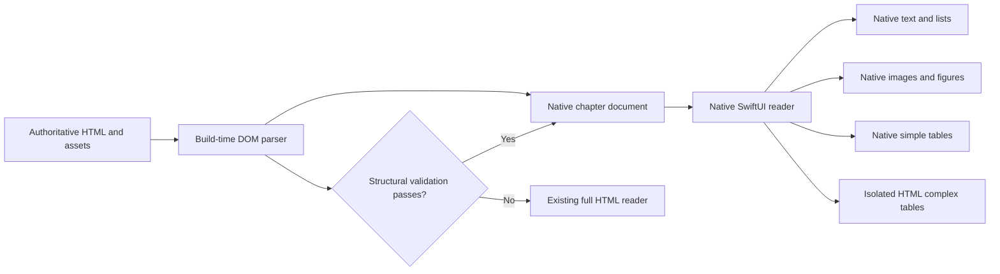

# Permitext Native iOS Reader Migration Plan

Status: Local implementation through Phase 11 exists on `codex/native-ios-reader-migration`; strict acceptance and release validation remain incomplete.

Last updated: 2026-08-19

Implementation and acceptance evidence is reconciled in [`NYC CC APP/docs/native-reader/NATIVE_READER_MIGRATION_COMPLETION_AUDIT.md`](NYC%20CC%20APP/docs/native-reader/NATIVE_READER_MIGRATION_COMPLETION_AUDIT.md). That audit distinguishes implemented code, automated checks, simulator evidence, physical-device evidence, and deferred release gates.

## 1. Objective

Move Permitext's iOS chapter-reading experience from the current full-chapter `WKWebView` reader to a native-first reader that is smoother, more stable, accessible, and easier to integrate with Search, Research, bookmarking, Projects, and native iOS navigation.

This is not an all-or-nothing "pure Swift" rewrite. The target is a native reader shell with fidelity-preserving fallbacks:

- Native SwiftUI/TextKit rendering for headings, paragraphs, lists, links, images, captions, selection, navigation, and reader controls.
- Native rendering for tables that can be reproduced exactly.
- An isolated HTML table component for complex tables until native rendering proves equivalent.
- The existing full HTML reader as an automatic chapter-level fallback whenever validation fails.

The existing enacted HTML and bundled assets remain the authoritative content source. No chapter, table, image, or figure is to be manually recreated in Swift.

## 2. Non-negotiable requirements

1. Preserve every enacted-text character, section number, heading, list item, table cell, caption, footnote, image, figure, and cross-reference.
2. Do not manually rebuild individual chapters, tables, or images.
3. Never silently omit unsupported content. Use a tested fallback.
4. Keep the existing HTML reader operational throughout the migration.
5. Do not switch a chapter to native rendering until automated structural validation passes.
6. Preserve stable section and anchor IDs so existing saved items, recent positions, Search results, Research citations, and deep links continue to work.
7. Do not perform HTML parsing, full Saved-library regeneration, or account-wide Project evidence rebuilding on the main thread.
8. The chapter itself must never scroll horizontally. Horizontal scrolling may exist only inside a table that requires it.
9. Native-reader failure must fall back safely to the authoritative HTML chapter rather than display partial content.
10. Do not remove the HTML fallback merely to claim that the reader is fully native.

## 3. Product decisions

### 3.1 Bookmarking

Remove paragraph swipe-to-bookmark behavior. It competes with vertical reading, is hard to discover, and currently maps a paragraph gesture to a section-level saved record.

Use one contextual bookmark control in the existing bottom current-section bar:

- `bookmark` when the currently visible section is not saved.
- `bookmark.fill` when the currently visible section is saved.
- One tap saves the section immediately.
- A second tap removes it immediately.
- Provide light haptic feedback and a short Saved/Removed confirmation.
- Do not present a card, folder sheet, or destructive confirmation for the basic toggle.
- Update Reader and Projects optimistically.
- Rebuild account-wide Project evidence asynchronously and coalesce repeated refresh requests.

### 3.2 Text selection and Research

Use native text selection. The native editing menu should retain standard system actions and add one Research action using the singular SF Symbol `sparkle`.

Research must receive:

- The stable section ID.
- The exact selected passage.
- The code version and chapter context already associated with that section.

### 3.3 Tables

Table fidelity is more important than making every table pure Swift.

Use three rendering levels:

1. Simple tables: native SwiftUI grid.
2. Complex but supported tables: native table component with table-confined horizontal scrolling.
3. Highly complex tables: isolated HTML table component inside the native reader.

Complex tables include merged cells, unusual borders, nested formatting, significant column sizing, embedded media, multi-row headers, or other structures not proven equivalent in the native renderer.

### 3.4 Images and figures

Images and figures should render natively from existing bundled assets:

- Preserve aspect ratio.
- Downsample away from the main thread.
- Load lazily.
- Display the source caption.
- Preserve accessibility text when supplied by the source.
- Tap to open a zoomable full-screen viewer.
- Display a visible diagnostic placeholder if an asset is missing.

## 4. Existing code to reuse

The repository already contains much of the required native foundation:

- `NYC CC APP/permitext/Views/ChapterReaderView.swift`
  - Native `ScrollView` and `LazyVStack` chapter reader.
  - Current-section tracking, jump navigation, and scroll restoration foundations.
- `NYC CC APP/permitext/Views/ContentBlockView.swift`
  - Structured content-block rendering.
  - Native attributed text.
  - Native image loading and viewing.
  - Native simple tables.
  - Isolated `WKWebView` rendering for complex tables.
- `NYC CC APP/permitext/Models/CodeModels.swift`
  - Existing `.html`, `.table`, and `.image` content-block types.
  - Structured table cells with row spans, column spans, borders, formatting, captions, and footnotes.
- `NYC CC APP/permitext/Data/PublishedHTMLContentStore.swift`
  - Chapter URL, anchor, table/image feature, and asset resolution foundations.
- `NYC CC APP/permitext/Views/ChapterHTMLReaderView.swift`
  - Current routing and full HTML fallback.
- `NYC CC APP/permitext/Views/ChapterHTMLWebView.swift`
  - Existing authoritative HTML presentation and comparison baseline.

The migration should extend and reconnect these systems rather than create an unrelated second reader architecture.

## 5. Current corpus baseline

The initial 2026-08-18 repository scan found:

- 463 authored chapter HTML files.
- 151 chapter files containing tables.
- 78 chapter files containing images or SVG.
- Large numbers of table spans and nontrivial table structures.

The exact inventory must be regenerated by the migration tooling and committed as a machine-readable report. These counts are a planning baseline, not a permanent content contract.

## 6. Target architecture

### 6.1 Authoritative source

The checked-in HTML, source metadata, prepared tables, and downloaded assets remain authoritative. Native documents are generated derivatives and must never be edited as a competing source of legal text.

### 6.2 Build-time parser

Use a standards-based DOM parser during content preparation. Do not use regular expressions as the primary content parser.

The parser emits a versioned native chapter document and a validation record for every chapter. Parsing should not occur when the user opens a chapter on the phone.

### 6.3 Native chapter document

Evolve the existing content-block models to cover:

- Heading
- Rich text paragraph
- Ordered list
- Unordered list
- Table
- Image
- Figure
- Caption
- Footnote
- Divider
- Source/editor note
- Unsupported HTML fallback

Every block must preserve:

- Stable block ID.
- Code version.
- Code-section ID.
- Chapter ID and number.
- Section ID and number.
- Original anchor ID.
- Block order.
- Plain text.
- Original source fragment or reference to it.
- Source hash.
- Link targets.
- Accessibility metadata.
- Table/image identifiers where applicable.

### 6.4 Eligibility manifest

Generate a versioned manifest that assigns every chapter one state:

- `native`
- `nativeWithTableFallback`
- `fullHTMLFallback`
- `invalidContent`

Reader routing must use this generated result. Do not maintain a manual list of chapter exceptions.

## 7. Implementation phases

### Phase 0: Baseline and safety harness

Tasks:

1. Create a dedicated feature branch for the migration.
2. Add a debug-only Native/HTML reader selector.
3. Capture reference screenshots and interaction recordings for representative chapters.
4. Record current cold load, warm load, scrolling, memory, Search, selection, bookmark, and tab-switch behavior.
5. Define a golden chapter set across every code family.
6. Preserve the current Reader as the default.

Golden content must include:

- Plain prose.
- Deeply nested ordered and unordered lists.
- Inline italics, bold text, links, and cross-references.
- Images, SVG, figures, and captions.
- Simple tables.
- Multi-row and multi-column merged cells.
- Multi-row table headers.
- Table captions and adjacent footnotes.
- Zoning tables, maps, illustrations, and appendices.
- Long chapters and unusually deep section hierarchies.

Exit gate:

- Baseline evidence is saved and the current release path is unchanged.

### Phase 1: Corpus inventory

Build a tool that reports, per chapter:

- File and source hash.
- Section count and stable anchors.
- Heading hierarchy.
- Text-block and list counts.
- Tables, dimensions, spans, captions, footnotes, borders, and embedded content.
- Images, SVGs, captions, dimensions, and asset paths.
- Links and link targets.
- Unknown elements, classes, or unsupported CSS.
- Eligibility state and reasons.

Commit the report in a reproducible form. Add a test that regenerates it and fails when unreviewed content variants appear.

Exit gate:

- Every chapter is inventoried, and no table/image variant is unknown without an explicit fallback classification.

### Phase 2: Parser and document model

Tasks:

1. Implement the build-time DOM parser.
2. Extend the existing content-block model only where necessary.
3. Preserve original source fragments for unsupported content.
4. Generate stable block and anchor IDs deterministically.
5. Generate source hashes and parser schema versions.
6. Store generated documents in a compact bundled form suitable for offline use.

Structural validation must compare:

- Normalized enacted text.
- Section sequence.
- Anchor sequence and mapping.
- Link targets.
- Table cell matrix, row/column spans, captions, and footnotes.
- Image/figure inventory and resolved assets.

Exit gate:

- The parser can process the entire corpus without silent loss. Failures produce explicit fallback classifications.

### Phase 3: Native text reader

Tasks:

1. Route a small debug-only set of validated, text-only chapters into `ChapterReaderView`.
2. Render content through lazy native blocks.
3. Use TextKit-backed views where selectable text and menu customization are required.
4. Preserve typography, hierarchy, inline formatting, and links.
5. Restore scroll position using stable section/block IDs.
6. Preserve Reader 1 and Reader 2 state independently.

Exit gate:

- Validated text-only chapters match the HTML source structurally and visually and remain smooth on the oldest supported iPhone.

### Phase 4: Native images and figures

Tasks:

1. Connect all image IDs to the existing asset manifests/resolvers.
2. Decode and downsample away from the main thread.
3. Add lazy loading, placeholders, retry, and full-screen zoom.
4. Preserve captions and accessibility text.
5. Verify raster, SVG-derived, map, diagram, and unusually large assets.

Exit gate:

- Every inventoried image and figure is resolved or causes its chapter to fall back. No blank/missing media is accepted.

### Phase 5: Tables

Tasks:

1. Validate and retain the existing simple native table path.
2. Build a table capability classifier from the inventory.
3. Add a native complex-table renderer only for structures that can be reproduced exactly.
4. Keep the existing isolated `TableWebView` for all other supported complex tables.
5. Keep horizontal scrolling confined to the table viewport.
6. Preserve captions, headers, merged cells, borders, formatting, and footnotes.
7. Prevent nested table WebViews from forcing chapter height or width instability.

Exit gate:

- Every table is structurally equivalent and visually reviewed, or the chapter uses a tested fallback.

### Phase 6: Native Reader features

Implement and verify:

1. Current-section tracking.
2. Jump within chapter.
3. Search within chapter.
4. Search highlighting and navigation between matches.
5. Internal reference navigation.
6. Cross-code reference navigation.
7. Scroll-position restoration.
8. Copy, Share, and Research in the native selection menu.
9. Singular `sparkle` Research icon.
10. Dynamic Type, VoiceOver, Reduce Motion, light mode, and dark mode.
11. Reader theme support without changing the enacted-content hierarchy.

Exit gate:

- Native chapters provide functional parity with the current Reader and pass accessibility checks.

### Phase 7: Bookmark and Projects reliability

Tasks:

1. Delete the paragraph swipe gesture and associated JavaScript/CSS listeners.
2. Add one bookmark toggle to the bottom current-section bar.
3. Apply saved/removed state optimistically.
4. Keep the database mutation small and immediate.
5. Decouple bookmark mutation from account-wide Project evidence regeneration.
6. Rebuild Project presentation asynchronously.
7. Coalesce repeated refreshes.
8. Ensure switching Reader to Projects does not trigger duplicate full-library rebuilds.
9. Ensure Projects reflects the saved/removed item immediately.

Exit gate:

- Save/remove feedback is immediate, and repeated Reader-to-Projects transitions do not freeze, crash, or show stale bookmark state.

### Phase 8: Performance and reliability hardening

Tasks:

1. Prebuild native documents rather than parsing on open.
2. Load chapter blocks lazily.
3. Prefetch only nearby content/media.
4. Cancel obsolete work when switching chapters or tabs.
5. Bound caches by count and memory cost.
6. Remove main-thread file reads, HTML conversion, large attributed-string construction, and Project evidence reconstruction.
7. Instrument chapter load, image decode, table load, selection, bookmark mutation, and Projects hydration.
8. Test background/foreground transitions and memory warnings.

Exit gate:

- Native mode is measurably smoother and no less stable than HTML mode on the oldest supported device.

### Phase 9: Automated fidelity and regression suite

Add tests for:

- Identical normalized enacted text.
- Section and anchor parity.
- Link-target parity.
- Table matrix and span parity.
- Caption and footnote parity.
- Asset existence and decode success.
- No unsupported block silently dropped.
- Search-result-to-section routing.
- Scroll restoration.
- Bookmark save/remove behavior.
- Reader 1/Reader 2 independent state.
- Reader-to-Projects transition.
- HTML fallback routing.

Add visual snapshots for:

- Light and dark appearance.
- Multiple iPhone widths.
- Portrait and landscape.
- Standard and larger accessibility text sizes.
- Representative chapters from every code collection.

Exit gate:

- The entire automated suite passes and all visual differences are reviewed.

### Phase 10: Controlled rollout

1. Keep native mode behind a feature flag.
2. Enable it first for internal debug builds.
3. Enable validated text-only chapters.
4. Enable chapters with images.
5. Enable chapters with native tables.
6. Enable chapters using isolated complex-table fallback.
7. Test through TestFlight on physical devices.
8. Retain a diagnostic control to open the same chapter in HTML mode.
9. Make native the default only after the acceptance criteria pass.

Exit gate:

- Physical-device and TestFlight evidence show no content loss, crash regression, navigation regression, or bookmark/Projects freeze.

### Phase 11: Default cutover and long-term fallback

1. Switch validated chapters to the native reader by default.
2. Keep the full HTML reader available for invalid, unknown, or newly introduced content patterns.
3. Keep parser schema versions and eligibility manifests tied to content-package versions.
4. When a code update introduces an unsupported construct, route it to HTML automatically until native support is added and validated.
5. Do not delete the HTML fallback unless a future independent decision establishes that it is no longer needed.

## 8. Required acceptance criteria

The migration is complete only when all of the following are true:

1. No enacted text is missing, reordered, or materially reformatted.
2. Every image and figure is displayed from its existing source asset or the chapter falls back.
3. Every table preserves its cell matrix, spans, caption, headers, and footnotes or the chapter falls back.
4. No content required manual chapter-specific Swift code.
5. Search, jump navigation, cross-references, selection, Research, and scroll restoration work in native mode.
6. The chapter cannot be dragged horizontally outside a table.
7. Bookmarking uses the single contextual control and toggles immediately.
8. Projects reflects bookmark changes immediately without blocking navigation.
9. Rapid bookmark/Reader/Projects cycling completes at least 100 iterations on a physical device without a crash, watchdog termination, hang, or stale state.
10. Native scrolling is smooth on the oldest supported iPhone.
11. Cold and warm chapter load times meet or improve the measured baseline.
12. Memory returns near baseline after leaving media-heavy chapters.
13. Native/HTML comparison tests pass across every code collection.
14. Invalid content always routes to the authoritative HTML fallback.
15. The existing web app and its content behavior are unaffected by this iOS migration.

## 9. Explicit non-goals

- Do not redesign enacted content.
- Do not manually simplify legal tables.
- Do not replace authoritative HTML with independently maintained Swift content.
- Do not remove the HTML fallback during the initial migration.
- Do not add unrelated Projects, Research, Notebook, Report, web, entitlement, or synchronization features.
- Do not deploy, push, merge to `main`, or submit to TestFlight/App Store until the user explicitly authorizes those steps.

## 10. Recommended first implementation slice

The first implementation task should contain only:

1. A dedicated branch.
2. The corpus inventory tool.
3. The generated inventory/eligibility report.
4. Structural tests for the report.
5. A debug-only Native/HTML reader selector.
6. Baseline measurements and representative screenshots.

Do not begin reader cutover in the first slice. The inventory must establish exactly which content structures exist before renderer changes begin.

## 11. New-task handoff prompt

Use this prompt in a new Codex task:

> Read `NATIVE_IOS_READER_MIGRATION_PLAN.md` completely. Treat it as the approved implementation specification. Before editing, inspect the current branch and relevant iOS reader files, then execute only Phase 0 and Phase 1. Preserve the current HTML reader and do not begin native chapter cutover. Create a dedicated feature branch, run proportionate tests, commit only intended files, and report validation evidence without pushing or merging unless I explicitly ask.
