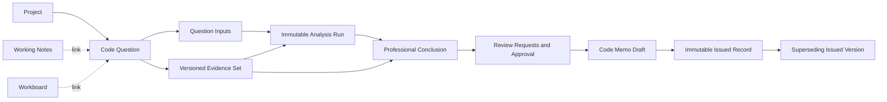

# Permitext Code Question Workspace Implementation Plan

- **Plan version:** 1.0
- **Prepared:** August 3, 2026
- **Repository:** `/Users/randy/Documents/X_CODING/Building Code`
- **Implementation status:** **PHASE 0 IN PROGRESS / COMPLETED ON BRANCH** (see progress ledger)
- **Purpose:** Product, architecture, migration, verification, and continuation plan

> Phase 0 scaffolding may proceed on an authorized implementation branch. Product UI reorganization and Phases 1–10 remain gated by their exit criteria. Do not enable the Code Question workspace capability in production until rollout stages allow.

---

## 1. Executive decision

Permitext should be reorganized around one first-class, Project-owned unit of professional work: the **Code Question**.

The product should express one continuous and traceable lifecycle:

> **Official code text → approved evidence → Project facts → bounded analysis → professional conclusion → review → immutable issued record**

In the interface, that lifecycle becomes:

> **Define → Evidence → Analyze → Review → Issue**

This is a reorganization and integration of systems Permitext already has. It is not a greenfield rebuild. The existing multi-column workspace, Reader, Search, saved passages, selected-evidence Research, Notebook, Coordination, Report Draft, immutable Report Manifest, Workboard, local-first storage, sync, permissions, and activity contracts are valuable foundations. They should be reused and connected to Code Questions.

The central product change is this:

- Today, several Project tools appear as neighboring destinations with roughly equal weight.
- In the target product, a professional opens a Project, chooses a Code Question, and moves that same record through a connected evidence-to-issuance workflow.
- Notebook and Workboard remain available as supporting tools.
- Research becomes the bounded analysis engine inside a Code Question.
- Coordination becomes structured Review Requests.
- Report Draft becomes an advanced supporting tool; the normal output is a question-specific Code Memo Draft followed by an immutable Issued Record.

Nothing should be deleted during the initial reorganization. Tools that are not part of the default path should move under **Add column** or **More** until real usage and migration evidence justify removal.

---

## 2. Authority and supersession

### 2.1 What this plan governs

This plan governs:

- the Code Question information architecture;
- the Define → Evidence → Analyze → Review → Issue lifecycle;
- the user-facing purpose and placement of existing Permitext tools;
- the web multi-column workspace arrangements;
- the additive data-contract and server changes needed to support Code Questions;
- migration and compatibility with existing Project material;
- the adapted iPhone/iOS experience;
- verification, pilot, rollout, rollback, and handoff requirements.

### 2.2 What this plan supersedes

For this scope, this plan supersedes:

- Projects being treated primarily as a subsection of Saved;
- Notebook, Research, Workboard, Report Draft, and Coordination appearing as equally important Project entry points;
- generic Report Draft being the normal starting point for a project-specific code decision;
- the older default flow of `Project → saved evidence → Notebook → Research → Report`;
- prior immediate-sprint ordering where it conflicts with establishing the Code Question workflow;
- any interpretation of the Stitch export as production-ready code.

### 2.3 What this plan does not supersede

This plan does **not** supersede:

- the selected-evidence boundary for Research;
- the distinction between candidate search results and approved evidence;
- canonical source authority and legal-content provenance rules;
- source-rights and licensing obligations;
- server-enforced authorization;
- local-first and offline behavior;
- sync compatibility and preservation of unknown records;
- immutable historical Research answers, evidence snapshots, reports, and activity;
- lawful deletion, retention, privacy, billing, production, and App Store gates;
- the rule that production deployment and production verification are separate from local code completion.

If an older document conflicts with this plan on navigation or tool hierarchy, this plan controls that limited subject. If an older specialized contract is stricter about evidence, AI, permissions, privacy, sync, or legal content, the stricter contract controls until deliberately revised.

---

## 3. Repository baseline at planning time

This snapshot is informational and must be rechecked before implementation.

- Planning branch: `codex/project-state-flicker-fixes`
- Planning HEAD: `4cdde772b` — `fix: stabilize project workspace transitions`
- Existing unrelated untracked file: `CODEX_NEW_CHANGES_INSPECTION_REPORT.md`
- That untracked report must not be staged, modified, or treated as current implementation truth without re-verification.
- The app is not a small Stitch-generated React project. The active web product has a mature plain-JavaScript workspace shell, server, contracts, local state, sync, tests, and bundled React-based Notebook/Workboard subsystems.

Important existing foundations include:

- `permitext-sync-server/public/index.html` — the active multi-column shell;
- `permitext-sync-server/public/app.js` — pane orchestration and most web behavior;
- `permitext-sync-server/public/workspace-state.js` — persisted pane order, widths, scroll state, and workspace normalization;
- `permitext-sync-server/public/styles.css` — established visual system and pane behavior;
- `permitext-sync-server/app.mjs` — server routes, storage, sync, Research, reports, and Project Foundation handlers;
- `permitext-sync-server/project-foundation-contract.mjs` — artifacts, links, immutable snapshots, activity, conflict rules, and sync compatibility;
- `permitext-sync-server/collaboration-contract.mjs` — versioned review threads and immutable review comments;
- `permitext-sync-server/report-contract.mjs` — draft normalization, immutable Report Manifest creation, exact-source materialization, and hashes;
- `permitext-sync-server/notebook-contract.mjs` — structured Notebook persistence and safe rendering;
- `permitext-sync-server/code-trust-contract.mjs` — current source trust and research-eligibility metadata;
- `permitext-sync-server/tests/workspace-state-contract.mjs` — baseline workspace-state behavior;
- `permitext-sync-server/tests/offline-contract.mjs` — baseline offline behavior;
- `NYC CC APP/permitext` — iOS models, local storage, sync, and Project Hub surfaces.

Do not resurrect removed standalone Project-detail render paths, obsolete pane IDs, or dead navigation paths to implement the new workspace. Extend the active pane registry and current Project-state machinery on the checked-out implementation.

### 3.1 Governing-document map

Read the documents needed for the active phase. Their authority is scoped, not interchangeable.

| Document | Authority for this plan | Use |
| --- | --- | --- |
| `README.md` | Current product doctrine | Local-first product boundary; Search candidates versus selected-evidence Research |
| `Permitext_Recommended_Implementation_Roadmap.md` | Governing foundation unless this plan explicitly supersedes its IA/order | Project records, evidence, Research, reports, authorization, sync, privacy, release gates |
| `PERMITEXT_AI_EVALUATION_REVIEW_HANDOFF.md` | Governing AI boundary | Selected passages, insufficiency, citations, prohibited unrestricted/automatic behavior |
| `permitext-sync-server/WEB_UI_UX_RULES.md` | Governing active web behavior | Multi-column desk, no workspace blink, pane visual and interaction rules |
| `NYC CC APP/IOS_APP_CONTEXT.md` | Governing iOS product boundary | Native responsibilities, selected-evidence doctrine, adapted Project Hub |
| `NYC CC APP/docs/nyc-legal-content-expansion.md` | Governing source-corpus/provenance constraint | Enacted-source inventory, exclusions, verification, rights metadata |
| `PERMITEXT_DEBUG_FIX_AND_HOTSPOT_REPORT.md` | Risk register; reverify against current HEAD | Concurrency, outbox, report-generation, and lifecycle hotspots |
| `PERMITEXT_RELEASE_WALKTHROUGH.md` | Manual role/workflow baseline; partly superseded by this IA | Owner/Editor/Reviewer/Viewer behavior and release verification |
| `PERMITEXT_CROSS_PLATFORM_REVIEW_HANDOFF.md` | Historical cross-platform context; explicitly may be stale | Repository map and prior asymmetries; verify before acting |

### 3.2 Visual reference contract

The latest reviewed Stitch package at planning time was:

- Path: `/Users/randy/Downloads/stitch_permitext_professional_research_workspace (1).zip`
- SHA-256: `d316d9aeddf234fc2e3a1d2aa3f49d62d9607b831970bf5d5edca998e3a94159`

The hash identifies the reviewed artifact even if the download path later changes. The package is reference material, not a dependency.

Retain or adapt only these structural ideas:

- Candidates → Reader → Evidence Tray;
- Approved Evidence → Bounded Analysis → Professional Conclusion;
- a calm, high-density professional workspace;
- approximate 64px rail, 64px application header, and 48px pane-header proportions, subject to reconciliation with active Permitext CSS and accessibility;
- restrained semantic color for Project context, source family, provenance, review, and status.

Reject direct import of its duplicated page shells, Tailwind/CDN runtime, remote fonts/icons/avatars, fictional legal content, reliability percentages, inconsistent workflow examples, border-heavy card treatment, and nonfunctional controls. Main workspace columns remain edge-to-edge and square; rounded surfaces are reserved for appropriate internal controls or grouped content under the established Permitext visual system. Use no gradients. Phase 0 must record any further Keep/Adapt/Reject decisions before UI implementation.

---

## 4. Product objective and professional boundary

### 4.1 Objective

Permitext should help an architect, engineer, code consultant, or reviewer answer a bounded Project-specific code question and preserve a reconstructable professional record of:

- what was asked;
- which Project facts were confirmed;
- which assumptions and unknowns remained;
- which official passages were considered and approved as evidence;
- which exact evidence and facts an analysis used;
- what the professional concluded;
- what reviewers requested, changed, and approved;
- what was issued, by whom, when, and from which versions.

### 4.2 Product boundary

Permitext is a professional research and decision-record workspace. It is not:

- an agency determination;
- a permit approval;
- a guarantee of compliance;
- a substitute for professional judgment;
- a complete catalog of every potentially applicable standard;
- an unrestricted AI answer engine;
- a system that silently converts search results into evidence;
- a system that treats model confidence as legal reliability.

Search may find candidate material. Only an explicit professional action may approve a passage into a Code Question’s Evidence Set. Analysis may use only the approved evidence and the versioned Project inputs attached to the question. The professional conclusion remains visibly separate from AI-generated analysis.

### 4.3 Primary success condition

A reviewer must be able to open any Issued Record and reconstruct the full decision chain without relying on mutable current state.

Every Issued Record must preserve or resolve to immutable snapshots of:

- the precise Code Question;
- confirmed facts, assumptions, and unknowns;
- the approved Evidence Set;
- the selected analysis, if any;
- the approved professional conclusion;
- review disposition and approval;
- authors, reviewers, timestamps, versions, hashes, and predecessor/successor lineage.

---

## 5. Product principles

1. **Evidence before answer.** Search results are candidates; approved immutable passages are evidence.
2. **One question, one traceable chain.** Define, Evidence, Analyze, Review, and Issue must operate on the same Code Question and versions.
3. **Professional judgment remains explicit.** AI analysis never silently becomes the professional conclusion.
4. **Uncertainty is first-class.** Assumptions, unknowns, conflicts, missing facts, and insufficient evidence remain visible.
5. **Source verification is not Project applicability.** A source can be authentic and still not govern a particular project condition.
6. **Issued means internally issued, not agency approved.** The interface must not imply official government status.
7. **History is additive.** Corrections create new revisions or superseding records; they do not rewrite history.
8. **Link, do not duplicate.** A Code Question links existing canonical, authored, Research, visual, and generated artifacts.
9. **Local-first remains real.** Offline editing, reload, queueing, reconnection, conflict handling, and recovery are separate requirements.
10. **Columns are the workspace.** Preserve resizable, reorderable, independently scrollable panes and their state.
11. **Progressive disclosure reduces clutter.** Supporting tools remain available without competing with the core lifecycle.
12. **Web and iOS share meaning, not identical layouts.** Web is the full creation environment; iPhone is an adapted Project Hub.

---

## 6. Users and permissions

Use the existing organization roles as the starting point: Owner, Editor, Reviewer, and Viewer. All enforcement must occur on the server as well as in the UI.

| Capability | Owner | Editor | Reviewer | Viewer |
| --- | --- | --- | --- | --- |
| Create/edit Code Questions | Yes | Yes | Comment/request only by default | No |
| Add or edit Project inputs | Yes | Yes | Request changes | No |
| Propose evidence | Yes | Yes | Request/add review feedback | No |
| Approve or reject evidence | Yes | No | Yes when assigned/authorized | No |
| Run bounded analysis | Yes | Yes | Optional, policy-controlled | No |
| Draft professional conclusion | Yes | Yes | Suggest/request changes | No |
| Open Review Requests | Yes | Yes | Yes | No |
| Resolve assigned Review Requests | Yes | Yes | Yes | No |
| Approve conclusion | Yes | No | Yes when assigned/authorized | No |
| Issue or supersede a record | Yes | No by default | No | No |
| Read issued and historical records | Yes | Yes | Yes | Yes, if Project access permits |

These defaults preserve the current split: Editors propose evidence and Reviewers/Owners approve or reject it. Firm policy may make approval and issuance stricter. Any broader Editor authority requires a separate, explicit product-policy decision. The initial implementation must not invent a new role system; it should add granular capabilities to the existing role and capability contracts.

---

## 7. Target information architecture

### 7.1 Global navigation

The normal global navigation should become:

- **Home** — recent Projects, assigned reviews, drafts needing attention, and recently issued records;
- **Code Library** — source families, Search, and Reader outside a Project;
- **Projects** — direct Project and Code Question access;
- **Reviews** — shown when collaboration/role capabilities make a cross-Project inbox useful;
- **Settings** — account, organization, subscription, source, offline, and application settings.

Reader, Search, Zoning Resolution, Research, and other current top-level buttons should no longer compete as equal destinations. Search and Reader live primarily inside Code Library and Evidence. Zoning Resolution becomes a source-family scope within Code Library, with its own trust and eligibility rules.

Layout operations such as Reset, Close All, saved arrangements, and workspace management should move into a compact layout menu. They remain available but should not dominate the product header.

### 7.2 Project navigation

Opening a Project should show:

- Project identity and Project color;
- address and bounded Project context;
- role/access status;
- sync/offline/conflict status;
- a Question index with derived state, responsible professional, review state, and last activity;
- Issued Records;
- a **More** area for Working Notes, Workboard, attachments, advanced Report Drafts, and legacy material.

The Project is the container. The Code Question is the normal unit of work.

### 7.3 Continuous lifecycle, not disconnected screens

Define, Evidence, Analyze, Review, and Issue are workflow stages and saved column arrangements—not five unrelated pages.

The user can:

- keep multiple columns visible;
- open another stage beside the current one;
- resize, reorder, close, or restore a column;
- return to prior work without losing selection, scroll position, filters, or drafts;
- use a stage control to open the recommended arrangement for that stage;
- use **Add column** to compose a custom desk.

The stage selector must never mutate facts or advance shared review/approval/issue state merely because it was clicked. Readiness and approval gates control consequential transitions.

### 7.4 Recommended arrangements

| Arrangement | Default columns | Purpose |
| --- | --- | --- |
| Define | Questions, Definition | Frame the question and govern facts, assumptions, and unknowns |
| Evidence | Candidates, Reader, Evidence Tray | Discover, inspect, and explicitly approve exact passages |
| Analyze | Approved Evidence, Bounded Analysis, Professional Conclusion | Generate constrained analysis and author the human conclusion separately |
| Review | Conclusion, Review Requests, History | Resolve evidence, fact, interpretation, and revision requests |
| Issue | Code Memo Draft, Readiness, Versions | Approve, issue, download, and inspect lineage |

These are defaults, not rigid screen boundaries. At 1440px and wider, three primary columns should be comfortably usable. At intermediate widths, the same horizontal workspace may show one or two columns at a time while preserving the rest. Tablet behavior may use a focused column with a drawer or tab switcher. iPhone uses the adapted Project Hub described later.

Use this responsive behavior as the implementation contract unless Phase 0 rendered testing proves that a small adjustment is necessary:

| Workspace width | Visible working model | Required behavior |
| --- | --- | --- |
| 1440px and wider | Up to three primary panes, plus collapsible Project/question context | Keep the active arrangement visible where role-specific minimum widths permit; overflow horizontally rather than compress legal text below its minimum |
| 1180–1439px | Two primary panes at useful reading widths | Keep remaining open panes in the same horizontal track; use `overflow-x: auto` and scroll the newly focused pane fully into view |
| 768–1179px | One focused pane plus a named pane switcher/drawer | Preserve every open pane and its state; switching visibility must not close panes or overwrite saved desktop width/order |
| Below 768px | One focused web pane or the adapted native Project Hub | Preserve the lifecycle and records; do not squeeze the desktop three-pane arrangement into an unusable miniature |

Initial role-specific minimums should be tested at approximately 288px for indexes/candidates, 340px for Definition/Evidence Tray/Review/Readiness, and 480px for Reader/Analysis/Conclusion/Memo panes. Phase 0 must reconcile these values with the active pane contract and long-form legal-text fixtures before they become CSS constants.

The outer workspace owns horizontal overflow. Each pane owns its normal vertical scroll. Reader tables or code grids may use a bounded inner horizontal scroller, but keyboard and touch users must be able to enter and leave it without a scroll trap. Sticky headers must not obscure focused content at browser zoom. Responsive visibility changes must never mutate the saved arrangement.

### 7.5 Column behavior requirements

Every lifecycle column must:

- use a stable pane identity scoped to Project and Code Question where applicable;
- preserve width, order, selection, filter, scroll position, and unsaved draft state;
- remain independently scrollable;
- support keyboard focus and named controls;
- expose loading, empty, offline, stale, conflict, permission, and error states;
- inherit the active Project color for Project-owned context;
- keep genuinely unassigned or not-yet-linked Research/Saved material visually neutral until it is attached to a Project;
- never show stale content from a previously selected Project or Code Question;
- open, close, resize, reorder, and switch Project without flashing the full workspace empty;
- use existing focus-visible outlines while avoiding a dense field of thin outline borders;
- work without remote runtime fonts, icon CDNs, avatars, or Tailwind CDN dependencies.

Every arrangement must use one shared application shell: the same rail, product header, Project/Question context, workflow stage control, pane-header actions, and sync/offline state. An arrangement may change the open columns, not create a separate imitation of the application.

Pane mechanics must include a non-drag alternative:

- a focusable resize separator with separator semantics, orientation, current/minimum/maximum values, Arrow-key adjustment, and Home/End behavior;
- named Move left and Move right actions;
- named Focus and Close actions;
- a deterministic focus destination after a pane closes;
- a polite live announcement after open, close, resize, reorder, Project switch, and Question switch;
- a single-pointer and keyboard alternative for every drag gesture.

The latest Stitch export is a visual reference only. Its strongest concepts are the Candidates → Reader → Evidence Tray and Approved Evidence → Analysis → Professional Conclusion arrangements. Its independent static pages, fictional legal examples, confidence percentages, remote dependencies, and nonfunctional controls must not enter production.

---

## 8. Tool disposition

No current user data or tool should be deleted in the first release.

| Current tool or concept | Target disposition | Default visibility |
| --- | --- | --- |
| Projects | Promote to direct global navigation and Project/Question index | Primary |
| Search | Rename/contextualize as Evidence Candidates inside Code Library and a Code Question | Primary in Evidence |
| Reader | Keep as the authoritative Evidence Reader | Primary in Evidence |
| Saved evidence | Reorganize as a question-specific Evidence Tray, while preserving Project and unassigned Saved views | Primary in Evidence |
| Research | Present as Bounded Analysis; reuse the existing selected-evidence engine and immutable answers | Primary in Analyze |
| Coordination | Present as Review Requests and optional cross-Project Reviews inbox; reuse existing threads/comments | Primary in Review |
| Report Draft | Use internally for the question-specific Code Memo Draft; keep generic/advanced Report Draft under More | Primary only through Code Memo |
| Reports | Present as Issued Records and Versions | Primary in Issue/Project |
| Notebook | Rename or describe as Working Notes; link cards to Code Questions when useful | Add column / More |
| Workboard | Keep as an optional Project Diagram/Workboard; never make it the main Project surface | Add column / More |
| Activity | Present as passive History/Audit, not a task-management replacement | Review / More |
| Zoning Resolution button | Move into Code Library source-family navigation and filters | Contextual |
| Reset / Close All / saved layouts | Consolidate in Layout menu | Secondary |
| Legacy unassigned Research/Saved/Reports | Preserve in a discoverable Legacy or Unassigned view | Secondary during migration |

Deletion may be considered only after migration telemetry, user interviews, export coverage, and at least one stable release prove that a tool is redundant. Hiding is reversible; destructive deletion is not.

---

## 9. Canonical domain model

### 9.1 Relationship model

### 9.2 Code Question

Add a first-class Project Foundation artifact named `codeQuestion`.

Minimum fields:

- stable internal ID;
- Project-scoped human display ID, such as `Q-001`;
- `projectID`;
- concise title;
- precise question text;
- optional scope and desired decision/output;
- jurisdiction and governing/as-of dates where known;
- responsible professional, assignee, and reviewer references;
- record state: active or archived;
- current definition revision;
- current Evidence Set version;
- current selected analysis ID;
- current conclusion revision;
- current review-round and approval references;
- latest Issued Record ID, if any;
- created/updated actors and timestamps;
- optimistic `expectedVersion`;
- archive metadata.

Project membership and authorization remain Project-level. Responsible-person, assignee, and reviewer references do not create a Question-level access-control list.

The selected Define/Evidence/Analyze/Review/Issue stage is per-user workspace state, not shared professional state on the Code Question. Shared readiness, review, approval, and issuance states belong to their respective versioned records and are derived for display. A question may legitimately have Issued Record v1 while a new working revision is in progress; do not force both facts into one status value. A list may show a derived label such as “Issued v1 · Revision in progress,” but that label is not canonical storage.

Allocate `Q-001`-style display IDs transactionally and enforce uniqueness within a Project. Never derive them by reading the current maximum and writing the next value without a lock or unique retry.

### 9.3 Question inputs

Add a first-class `questionInput` artifact or an equivalently granular child-record contract. Do not store critical inputs as undifferentiated prose.

Each input needs:

- stable ID and parent Code Question ID;
- kind: `confirmedFact`, `assumption`, or `unknown`;
- statement;
- state: proposed, confirmed, disputed, resolved, or retired as applicable;
- basis/source, if any;
- responsible person;
- created/updated actor and time;
- revision and prior value lineage;
- optional anchored Review Request references.

Rules:

- An assumption must never be visually rendered as a confirmed fact.
- An unknown may block approval or issuance based on policy.
- Any semantic input change marks dependent analyses and approvals stale; presentation-only metadata exceptions must be explicitly enumerated.
- Issuance snapshots the exact input versions; later edits do not change the prior record.
- Only explicitly selected, versioned `questionInput` snapshots may enter Bounded Analysis. Working Notes, review comments, Workboards, Report text, templates, disclaimers, and general Project prose must never become hidden or authoritative model context.

### 9.4 Approved evidence and Evidence Sets

Generalize the current Research-time evidence snapshot into an independently persisted version-2 evidence snapshot, or embed the complete immutable snapshot in each Evidence Set. Do not assume the current Research-answer snapshot already exists as a reusable pre-analysis artifact. Prefer a reusable `evidenceSnapshotV2` whose content hash covers canonical source identity, exact passage text, locator, structured grid/visual material, and source version—but excludes Evidence Set number, approval, role, and rationale metadata.

Keep evidence proposals and review disposition separate from immutable approved `questionEvidenceSet` versions. A proposal may be proposed, verification-blocked, approved, rejected, or excluded. Rejected/excluded items remain in audit history but do not enter the approved set.

Each Evidence Set entry needs:

- version-2 evidence snapshot ID or complete embedded immutable snapshot;
- exact source identity and passage locator;
- quoted text and text hash;
- structured table/grid or visual snapshot when relevant;
- role: governing, supporting, or conflicting;
- analysis-eligibility and any explicit qualification;
- professional note/rationale;
- approval actor and time;
- source verification state at approval;
- Project applicability note, kept separate from source verification.

Rules:

- A bookmark, search result, or Saved section is not approved evidence.
- For an Editor, **Add as Evidence** creates a clearly labeled proposal. A Reviewer or Owner approval creates/reuses the immutable passage snapshot and adds it to a new Evidence Set version. An authorized solo Owner may propose and approve in an explicit combined flow.
- Only explicitly approved and analysis-eligible entries enter model input. Verification-blocked material requires a defined approval/qualification rule or remains excluded from analysis.
- Removing evidence creates another version; it does not alter a set used by an existing analysis or issued record.
- The UI must show source drift, edition mismatch, incomplete context, and conflicting evidence before analysis or issuance.

### 9.5 Analysis Run

Do not build a second AI system. Reuse the current selected-evidence Research pipeline and immutable Research answer, but invoke it through a new question-bound server command. That command must resolve the exact question revision, selected Question Input snapshots, and Evidence Set on the server, then atomically create the Research answer and analysis descriptor. It must not rely on mutable conversation selections or live general Project context after validation.

Add `questionAnalysis` as a lightweight immutable descriptor/link containing:

- Code Question ID;
- question definition revision and hash;
- exact Question Input snapshot/version IDs and Input Set hash;
- exact Evidence Set ID, version, and hash;
- canonical dependency hash;
- existing immutable Research answer ID;
- model and analysis-policy identifiers;
- prompt/template version;
- requested/created actor and time;
- idempotency/request ID;
- citation/dependency validation result.

The generated conclusion, explanation, citations, assumptions, missing facts, limitations, and additional-evidence needs remain only in the existing immutable Research answer. The question-analysis descriptor references that answer; it must not copy the generated output or later mutate to add a stale reason/successor.

Compute staleness by comparing the run’s immutable dependency hash with the current dependency hash. The canonical dependency hash must cover the precise question/scope/jurisdiction/as-of content, every selected active Question Input ID/kind/state/text/revision, and the Evidence Set ID/version plus snapshot content hashes, roles, qualifications, and eligibility. Exclude only enumerated presentation metadata such as Project color, pane layout, timestamps, and assignee display. Store current selection or successor relationships on the question or as append-only events.

Analysis rules:

- The model may reason only from approved analysis-eligible evidence and explicitly selected Question Input snapshots.
- It must distinguish confirmed facts from assumptions and unknowns.
- It must refuse or qualify conclusions when evidence is insufficient.
- It must not import uncited search results, model memory, or invented Project facts.
- It must never approve itself.
- Any dependency-hash change marks the run stale.
- AI is optional. A professional may proceed from approved evidence directly to a human-authored conclusion, review, and issuance without spending an allowance or creating an Analysis Run.

### 9.6 Professional Conclusion

Add a `professionalConclusion` artifact with explicit revisions.

Each published conclusion revision is immutable and must contain:

- Code Question ID;
- exact question-definition revision and hash;
- exact Question Input Set IDs/revisions and hash;
- exact Evidence Set ID/version/hash;
- optional Analysis Run ID and dependency hash;
- authored conclusion;
- reasoning/conditions;
- citations to approved evidence;
- disclosed assumptions and unresolved unknowns;
- author and revision timestamps;
- AI-assistance disclosure where required by policy;
- predecessor revision ID.

An editable working draft may autosave, but approval must target one published immutable conclusion revision. Editing after approval creates a new revision and invalidates the prior approval for current issuance; it does not modify the approved revision. Store approval and supersession as separate versioned records/events rather than fields that rewrite an immutable revision.

The UI must keep **AI Analysis** and **Professional Conclusion** visually and semantically separate. Copying or adapting an analysis into the conclusion is an explicit authored action with attribution.

### 9.7 Review Requests

Evolve `reviewThread` and `reviewComment`; do not create a parallel collaboration store.

User-facing request types:

- Fact Request;
- Evidence Review;
- Interpretation Review;
- Revision Request.

Compatibility mapping:

- Fact Request uses the existing `missing-project-fact` kind plus a versioned `requestType: fact-request`;
- Revision Request uses the existing `revision-request` kind plus `requestType: revision-request`;
- Evidence Review and Interpretation Review initially retain the existing `general-review` kind and add `requestType: evidence-review` or `interpretation-review`;
- preserve current internal identifiers and add v2/v3 adapters so old clients do not reject or coerce an unknown `kind`.

Extend review targets to include:

- Code Question;
- Question Input;
- approved evidence or Evidence Set entry;
- Analysis Run;
- Professional Conclusion;
- Code Memo Draft.

Preserve stored statuses `open`, `waiting`, `resolved`, and legacy `dismissed`, plus assignment, actors, dates, immutable comments, and append-only activity. **Reopen** is an action that transitions a resolved/dismissed thread back to `open` and records a reopen event/review-round increment; `reopened` is not a stored status. History remains passive; it is not a second coordination system.

### 9.8 Code Memo Draft and Issued Record

Reuse `reportDraft`, `reportManifest`, generated Report files, exact source materialization, and hashing.

The ordinary output path should be a constrained question-specific **Code Memo Draft** with:

- Project and question identity;
- prepared date and draft revision;
- question presented;
- Project inputs;
- governing and supporting evidence;
- bounded analysis summary, if selected;
- professional conclusion;
- assumptions, unknowns, limitations, and conditions;
- review/approval summary;
- citations and source appendix.

Use a typed Report Draft v2 such as `recordType: codeDecisionMemo` with `questionID` rather than inventing an unrelated editor. The current draft-v1 normalizer strips unknown fields, so add explicit v1→v2 adapters and never rewrite stored v1 payloads. Keep the advanced generic Report Draft available under More.

Create Report Manifest v3 for Code Questions. It must add the question snapshot, Evidence Set/snapshot identities, approval, evidence roles/qualifications/applicability, conclusion revision, and issue lineage while retaining v1/v2 readers. Never mutate stored Manifest v1/v2 payloads.

Add an immutable `issuedDecisionRecord` wrapper that references the immutable Report Manifest and generated files, and preserves:

- exact component versions and hashes;
- issue number/version;
- status: Issued or Superseded;
- issuing actor and approval basis;
- predecessor and successor IDs;
- correction/supersession reason;
- structured semantic manifest for web/iOS parity.

Issuance must be a server-authorized, transactionally coordinated operation. It must not reuse a check-then-write version allocator that can create duplicate versions or orphaned files. A correction creates a new version and can mark the prior version Superseded; the prior record remains readable subject to lawful account-deletion and retention rules.

Because Blob/object storage cannot participate in a Postgres transaction, implement issuance as an idempotent saga:

1. Authorize, validate dependencies, and bind an idempotency key.
2. In a database transaction, reserve the question-local issue version and a pending issuance record using uniqueness constraints.
3. Generate deterministic content/hashes and upload to a deterministic staged object key with retry-safe semantics.
4. In a database transaction, save/confirm Manifest v3, the issued wrapper, links, and activity, then mark the pending record issued.
5. Publish or resolve the deterministic object reference.
6. Retry safely with the same key or clean abandoned staged objects through a recovery job.

A failure at any point must leave no visible half-issued record. The approved draft remains unissued, and retry resumes or reconciles the same pending operation.

Keep version scopes explicit and separately constrained:

- Project-scoped Code Question display sequence: `(projectID, questionNumber)`;
- question-scoped Evidence Set version: `(questionID, evidenceSetVersion)`;
- existing Project/report sequence where required by Report Manifest history;
- question-scoped issued version: `(questionID, issueVersion)`;
- predecessor/successor identity for supersession, independent from the Project report sequence.

The Issue UI state model is:

> **Draft → Ready for approval → Approved → Issuing → Issued → Superseded**

“Final,” “record locked,” or immutable styling must not appear before the server confirms successful issuance. A failed issue command returns to a clearly unissued Approved state with a durable error and safe retry; it must not leave a half-issued visual or orphaned version.

### 9.9 Activity and audit

Reuse append-only Project activity for meaningful professional events:

- question created or archived;
- input confirmed, disputed, or materially revised;
- evidence approved, removed, or found stale;
- analysis generated or marked stale;
- conclusion revised or approved;
- Review Request opened, assigned, resolved, or reopened;
- record issued or superseded;
- migration/promote action completed.

Do not record keystrokes, scroll events, pane resizing, routine sync noise, or every autosave as professional activity.

### 9.10 Canonical transition rules

The implementation and tests must use these transitions. User-facing summary labels may combine them, but storage must not collapse them into one mutable “workflow status.”

| Record | Transition | Authorized actor | Preconditions and effect |
| --- | --- | --- | --- |
| Code Question | nonexistent → active | Owner or Editor | Allocate stable ID and transactionally unique Project question number; create first definition revision |
| Code Question | active → archived | Authorized Owner/Editor | Hide from normal active list; preserve all links and issued history; no cascading delete |
| Code Question | archived → active | Authorized Owner/Editor | Restore without changing historical versions |
| Evidence proposal | proposed → approved | Reviewer or Owner | Verify source/eligibility; create/reuse immutable snapshot and a new approved Evidence Set version |
| Evidence proposal | proposed → rejected / verification-blocked / excluded | Reviewer or Owner | Preserve proposal/disposition in audit; do not place it in model input |
| Evidence Set | vN → vN+1 | Reviewer or Owner | Add/remove/reclassify approved entries; preserve vN; dependency hash changes and prior analysis/approval becomes stale |
| Analysis Run | nonexistent → immutable run | Owner/Editor with Research capability | Server resolves exact dependencies and allowance; create Research answer + descriptor atomically; run never mutates |
| Conclusion | working draft → immutable revision | Owner or Editor | Bind exact definition/Input/Evidence/optional Analysis hashes; later edits create another revision |
| Conclusion approval | unapproved revision → approved revision | Reviewer or Owner | All blocking review/readiness rules pass; approval targets one immutable revision |
| Conclusion | approved revision → newer working/revision | Owner or Editor | Preserve prior approval historically; current working revision is unapproved and cannot reuse that approval |
| Review Request | open ↔ waiting | Authorized assignee/reviewer/editor | Record actor/time and response expectation |
| Review Request | open/waiting → resolved or dismissed | Authorized reviewer/assignee under policy | Preserve immutable comments and resolution event |
| Review Request | resolved/dismissed → open | Authorized Reopen action | Store `open`, append reopen event, increment review round; never store `reopened` |
| Code Memo | Draft → Ready for approval | Owner or Editor | Current dependencies validate and every blocker is resolved; no issue date exists |
| Code Memo | Ready → Draft | System or editor | Any governed content change or failed readiness invalidates Ready state |
| Code Memo | Ready → Approved | Reviewer or Owner | Approval binds exact Draft v2/Manifest-input hashes and conclusion revision |
| Code Memo | Approved → Issuing | User with issue capability | Server revalidates permission/dependencies and begins one idempotent issuance saga |
| Code Memo | Issuing → Approved | System failure/recovery | Durable failure is shown; no Issued Record is published; same idempotency key may retry |
| Code Memo | Issuing → Issued | Server | Saga commits Manifest v3, issued wrapper, links, activity, and resolvable file |
| Issued Record | Issued → Superseded | Server when a later issue succeeds | Prior record remains immutable/readable; link successor and reason |

Readiness rules must classify unresolved information as one of:

- **Blocker** — issuance cannot proceed;
- **Disclosed limitation** — an authorized professional accepts and exposes the uncertainty in the conclusion and memo;
- **Accepted condition** — the conclusion is expressly conditional on the stated fact/event and the record preserves that condition.

AI is never a transition prerequisite. An approved human conclusion may proceed without an Analysis Run.

---

## 10. Source provenance and evidence eligibility

Evolve `code-trust-contract.mjs` additively to a richer provenance contract. Existing version-1 profiles need a compatibility adapter.

Each canonical source package should be able to express:

- stable source identity;
- jurisdiction and issuing authority;
- source family and legal class;
- edition, publication, adoption, effective, repeal, and applicability dates;
- current-through date;
- enacted, proposed, future-effective, historical, explanatory, agency-guidance, incorporated-standard, or publisher-editorial status;
- official source URL and archived-source hash;
- text/extraction hash and extraction date;
- completeness and known missing artifacts;
- verification actor, date, method, and status;
- rights/licensing constraints;
- Search, Reader, Evidence, Analysis, and Issuance eligibility;
- required warnings or boundary language.

Adding a metadata class does not authorize ingestion, copying, display, Evidence eligibility, or AI use. Existing corpus exclusions and source-rights review remain controlling, especially for agency guidance, incorporated standards, and publisher editorial material.

The UI may use semantic status colors, but color alone is insufficient. Use labels such as:

- Verified official source;
- Verification required;
- Historical / not current;
- Explanatory only;
- Not eligible as governing evidence.

Do not use numeric “reliability” or “confidence” percentages for legal authority. Do not claim “official,” “complete,” “verified,” or “compliant” unless the stored provenance supports the exact claim.

Source verification and Project applicability must be shown separately:

- **Source verification:** Is this text authentic, complete, and correctly versioned?
- **Project applicability:** Does this provision govern this Project, date, occupancy, scope, and condition?

---

## 11. Web architecture plan

### 11.1 Preserve the workspace engine

Extend, do not replace:

- the existing pane registry;
- persisted pane widths and order;
- scroll and filter restoration;
- named workspace/layout state;
- resize and reorder behavior;
- Project color propagation;
- Project-switch cleanup and stale-state protections.

Each question-scoped pane key must include both Project ID and Code Question ID. State normalization must close or rebind panes that no longer belong to the active Project/question. Old saved layouts must continue to normalize safely.

### 11.2 Contracts

Create:

- `permitext-sync-server/code-question-contract.mjs` — normalization, validation, lifecycle/readiness derivation, immutable snapshot composition, migration adapters, and deterministic IDs where needed;
- focused contract tests for all new record types and transitions.

Extend additively:

- `project-foundation-contract.mjs` — new artifact and target kinds, conflict policies, activity actions, and compatible transport support;
- `collaboration-contract.mjs` — versioned `requestType`, question-level targets, and legacy kind/status adapters;
- `report-contract.mjs` — Report Draft v2, Manifest v3, typed Code Memos, and issued-record lineage without mutating prior manifests;
- `code-trust-contract.mjs` — provenance version 2 and version-1 adapters;
- organization capability contracts — edit, approve, review, issue, and supersede permissions.

Unknown new records must remain safe for older clients under preserve-and-ignore behavior. That policy alone is insufficient for new fields/enums inside a known artifact, so maintain frozen released-web and released-iOS decode fixtures, gate new serialization/commands by authenticated rollout eligibility and client capability, and test one shared Project edited by old and new clients before opt-in.

### 11.3 Storage and concurrency

Reuse the existing generic Project Foundation artifact/link/activity substrate for payloads and relationships where it preserves the current model. Do not defer correctness constraints to later profiling. Phase 0 must choose and document dedicated counters/tables, transactional locks, or equivalent database constraints for Project question numbers, Evidence Set versions, idempotency, pending issuance, and question issue versions before Phase 1.

Required guarantees:

- additive schema changes only during rollout;
- explicit `expectedVersion` optimistic concurrency, matching the repository convention;
- atomic compare-and-swap inside the storage adapter/database write rather than handler-level read/check/write;
- unique version constraints for Evidence Sets and Issued Records;
- the issuance saga and staged-file recovery defined in Section 9.8;
- idempotency keys for analysis, migration, and issuance commands;
- atomic local mutation plus outbox insertion before any iOS mutation capability is enabled;
- retry-safe commands and deterministic migration IDs;
- no cascading deletion of independently owned canonical or authored artifacts when a question is unlinked or archived.

Project Foundation artifacts are not automatically covered by the current general `/sync/push` and `/sync/pull` mutation set. Phase 0 must make an explicit offline transport decision. The recommended design is:

- canonical question commands remain server-authorized and idempotent;
- local IndexedDB/SQLite stores the last confirmed Question artifacts and working drafts;
- extend the shared change feed for incremental Question-artifact pull;
- use a dedicated idempotent Question-command outbox, or deliberately extend the existing mutation-kind outbox with equivalent conflict semantics;
- keep this outbox as transport, not a second domain store;
- require authoritative online validation for approval and issuance.

Do not claim offline support merely because generic Foundation JSON exists locally. Prove cold reload, queued command replay, `expectedVersion` conflict handling, permission changes, and rollback with pending new-client commands.

### 11.4 Server endpoints

Add question-oriented handlers using the repository’s established authentication, organization, Project Foundation, error, and sync conventions. The exact route names may follow the active server style, but the capabilities must cover:

- list/create/read/update/archive Code Questions;
- create/update/confirm/dispute Question Inputs;
- approve/remove evidence and create Evidence Set versions;
- generate/list/select question-bound analyses;
- create/revise professional conclusions;
- open/respond/resolve/reopen Review Requests;
- prepare/validate/approve/issue/supersede Code Memo records;
- migrate/promote legacy artifacts;
- retrieve full immutable lineage.

Do not add parallel endpoints that reproduce current Research, Notebook, report, or collaboration storage. Question handlers should call those existing subsystems and create explicit links.

### 11.5 Web client modules

The existing `public/app.js` is large. New behavior should be placed in bounded modules where the current build/runtime permits, with `app.js` acting as orchestrator rather than receiving another monolithic feature block.

Suggested modules:

- `public/code-question-state.js`;
- `public/code-question-contract.js` or a browser-compatible shared build;
- `public/question-workspace.js`;
- `public/question-evidence.js`;
- `public/question-review.js`;
- `public/question-issue.js`.

Module names are recommendations, not requirements. Avoid a broad refactor unrelated to the feature. Preserve current startup, offline shell, service-worker cache, and versioned-client behavior.

### 11.6 Accessibility and responsive behavior

At minimum:

- meet WCAG 2.2 AA for the authenticated web application and generated HTML/PDF output;
- identify the active workflow stage with `aria-current="step"` or an equivalent semantic state;
- give navigation and all icon-only controls accessible names, while hiding decorative icon glyphs from assistive technology;
- give all inputs associated programmatic labels, semantic field groups, inline error associations, and an error summary for failed submission;
- pane headings and landmarks need coherent semantics;
- stage, active pane, review status, and selected evidence need non-color state;
- hover-only actions must also work by keyboard and touch;
- focus must be restored when a pane opens/closes or a dialog completes;
- dialogs and drawers must trap focus appropriately and make the obscured background inert;
- resize/reorder needs the keyboard and single-pointer alternatives defined in Section 7.5;
- hidden scrollbars must not conceal that legal text is scrollable;
- visible keyboard focus must not be obscured by sticky UI;
- forced-colors/high-contrast mode, text spacing, and 200%/400% zoom must remain usable;
- primary touch targets should be at least 44×44px where practical;
- legal text must retain semantic headings, lists, tables, captions, and header cells;
- reduced-motion preferences must be honored;
- 1440px, 1180px, tablet, and zoomed desktop states require rendered verification.

---

## 12. iPhone/iOS plan

Do not reproduce the full desktop column editor on iPhone.

The iPhone experience should be an adapted Project Hub with:

- Project and Code Question lists;
- derived question state, responsible professional, and review state;
- read-only Define, Evidence, Analysis, conclusion, and Issued Record continuity in the first compatibility slice;
- limited Define edits only in a later mutation slice and only where role/capability permits;
- approved Evidence Set reading and source trust cues;
- read-only Analysis summaries;
- professional conclusion review and comments;
- Review Request reading, followed later by response/resolution when mutation safety is proven;
- Code Memo preview, issue status, versions, and secure download;
- Working Notes access;
- flattened Workboard preview rather than full Excalidraw editing initially;
- offline reading, with edit queueing added only for explicitly enabled artifact/command types.

Web and iOS must share:

- IDs and version identity;
- semantic content and ordering;
- exact Evidence Set and citation identities;
- status and review transitions;
- Report Manifest and Issued Record lineage;
- permission results;
- source verification and uncertainty cues.

Split iOS delivery into two gates:

1. **Compatibility gate before web rollout:** update decoders, local schema, sync preservation, read-only rendering, and mixed-version fixtures so new records cannot be discarded or corrupted.
2. **Mutation gate after compatibility:** enable limited Fact Request responses/resolution or Define edits only after server authorization, atomic local mutation/outbox insertion, `expectedVersion` conflicts, offline retry/recovery, and physical-device behavior are proven.

Do not imply full semantic editing parity is already approved. Test mixed-version clients and shared Projects explicitly.

---

## 13. Migration and backward compatibility

### 13.1 Migration policy

Schema/bootstrap migration must be additive, deterministic, idempotent, checkpointed, observable, and reversible at the UI level. User-content promotion is a separate, explicit command workflow; do not create Code Questions from notes, Research, or Reports as a side effect of reading `projectFoundationState`.

Never:

- delete legacy Notebook, Saved, Research, Report, Workboard, or Coordination records;
- rewrite immutable Research answers, evidence snapshots, Report Manifests, or comments;
- silently treat Saved bookmarks as approved evidence;
- guess that a Notebook question card is an authoritative Code Question;
- invent facts to complete a migrated question;
- collapse distinct artifact types into one generic record;
- require all old content to fit a fake “Legacy Project Research” question.

### 13.2 Promotion instead of guessing

Provide explicit actions such as:

- **Create Code Question from this note**;
- **Link to Code Question**;
- **Add selected passage as Evidence**;
- **Use this Research answer in a Code Question**;
- **Prepare Code Memo from this Report Draft**.

These actions preserve every source artifact and source ID, create a distinct new Code Question ID, and record a provenance link between them. Copy content only when an immutable snapshot or explicit authored starting point is required; never reuse the source ID as the question ID.

### 13.3 Automatic migration eligibility

Automatic schema/bootstrap migration may normalize records created by an earlier Code Question schema version. Automatic association of user content is allowed only when an earlier feature version already stored an explicit stable Question relationship and the adapter validates it. A shared Project ID, similar title, nearby timestamp, or overlapping evidence is not sufficient.

Ambiguous records remain in Legacy/Unassigned views and are counted, not guessed.

### 13.4 Checkpoints and reporting

Use the existing checkpointed migration pattern for schema/bootstrap work. Record user-triggered promotions as separate idempotent professional activity/command results. For both, record:

- migration version;
- started/completed time;
- deterministic source and target IDs;
- migrated count;
- already-current count;
- skipped count and reason;
- ambiguous count;
- failed count and recoverable error;
- last successful checkpoint;
- client/server versions.

Restarting a schema migration or retrying a promotion command must not create duplicate questions, links, Evidence Sets, or issued versions.

### 13.5 Feature flag and rollback

Introduce a server capability and internal feature flag such as `permitext:codeQuestionWorkspace`.

Rollout sequence:

1. Contracts and storage available, UI off.
2. Internal accounts and synthetic fixtures.
3. Selected real Projects with explicit opt-in and eligible client versions.
4. New Projects default to Code Questions; legacy tools remain available.
5. Existing Projects receive guided promotion tools.
6. Default navigation changes only after parity and recovery are proven.

Rollback disables the new UI and creation commands, pauses new-client outbox replay safely, and preserves queued intent for a compatible retry/recovery path. Because storage changes are additive, existing artifacts and new question records remain intact. Preserve-and-ignore applies to unknown records, but compatibility fixtures must separately prove that older clients do not coerce new fields inside known records. Never roll back by deleting migrated records.

---

## 14. Phased implementation plan

The phases below are sequential gates, not calendar estimates. Several test-writing and visual-design tasks can run in parallel after their governing contracts are stable.

### Phase 0 — Baseline, safety rails, and executable specification

**Goal:** Establish a trusted pre-change baseline and make the target behavior testable.

Tasks:

- Recheck branch, HEAD, worktree, active Project render path, and deployed-client status.
- Inventory current Project, Saved, Research, Notebook, Coordination, Report, Workboard, sync, permission, and iOS behaviors.
- Reverify old defect reports against current HEAD; do not assume historical findings remain current.
- Add the feature/capability flag with no visible behavior change.
- Define versioned synthetic fixtures for one complete Code Question lifecycle. Every rendered Define, Evidence, Analyze, Review, and Issue view must use the same Code Question ID and coherent version chain rather than unrelated hard-coded examples.
- Define a separately verified legal-content fixture for rendered acceptance tests; do not use Stitch’s fictional provisions as authority.
- Create a Stitch visual-adoption matrix with explicit Keep, Adapt, and Reject decisions. Keep the two useful pane arrangements; reject direct import of its duplicated shells, palette, radii, border-heavy styling, Tailwind tokens, AI Reader highlighting, avatars, remote assets, reliability percentages, and fictional legal content. Reconcile every adopted visual token with the active Permitext CSS before Phase 2.
- Capture baseline workspace, offline, sync, Research, report, and Project-switch tests.
- Freeze representative released-web and released-iOS decode/round-trip fixtures for mixed-client testing.
- Write architectural decision records for artifact granularity, dedicated counters/uniqueness, atomic `expectedVersion` compare-and-swap, offline Question transport/outbox, the issuance saga and staged-file recovery, Report Draft v2/Manifest v3 adapters, permission mapping, and URL/pane identity.

Likely files:

- `permitext-sync-server/package.json`
- `permitext-sync-server/tests/`
- capability/organization contracts
- test fixture directories
- no production UI changes beyond a disabled flag.

Exit gate:

- current targeted and full baseline checks pass;
- fixtures contain no unverified legal claim presented as production truth;
- storage/counter, offline transport, report-version, mixed-client, and issuance-saga decisions are explicit and testable;
- feature is completely inert when disabled;
- implementation branch and intended file scope are cleanly documented.

### Phase 1 — Code Question contracts, storage, permissions, and migrations

**Goal:** Introduce the domain model without changing the primary UI.

Tasks:

- Add `code-question-contract.mjs` and tests.
- Add Code Question, Question Input, evidence-snapshot v2, Evidence Set, question-analysis descriptor, Professional Conclusion, and Issued Decision Record artifact kinds.
- Extend Project link targets, activity actions, conflict policies, and sync record handling.
- Extend collaboration `requestType`/targets compatibly while retaining legacy kinds and stored statuses.
- Add Report Draft v2 and Manifest v3 with backward readers/adapters.
- Add permission capabilities for edit, evidence approval, review, conclusion approval, issue, and supersede.
- Add server handlers and local adapters.
- Add dedicated uniqueness/counter guarantees, atomic compare-and-swap, idempotency, pending-issuance state, and staged-file recovery.
- Implement the chosen Question change-feed/outbox transport behind the disabled capability.
- Add checkpointed, no-op-by-default migration scaffolding.
- Update iOS decoders to preserve unknown/new records before shared rollout.

Exit gate:

- contract tests cover every valid and invalid state transition;
- concurrent mutations return explicit conflicts instead of losing edits;
- migration reruns are idempotent;
- frozen old clients preserve/ignore unfamiliar records and do not coerce new fields in known records;
- no legacy artifact is modified or deleted;
- disabled UI behaves exactly as before.

### Phase 2 — Project and Question workspace shell

**Goal:** Make the Project → Code Question hierarchy clear while preserving column mechanics.

Tasks:

- Promote Projects to direct navigation.
- Add Project Question index with search, filter, derived state, responsible professional, and recent activity.
- Add create, rename, archive, restore, and open actions subject to permission. Defer duplication until explicit copy semantics are separately approved.
- Add lifecycle stage control and Add column menu.
- Use one shared shell for all arrangements; lifecycle presets may only change open/focused panes and stage context.
- Add question-scoped pane identities and workspace-state normalization.
- Add stable Project/question deep links and browser-history restoration without duplicating pane state.
- Preserve active Project color across all Project/question panes.
- Move Notebook, Workboard, advanced Report Draft, attachments, and legacy content into More/Add column.
- Keep a clear Legacy/Unassigned path during migration.
- Ensure Project or question switching cannot leak content or flash the workspace empty.

Exit gate:

- existing saved layouts still load or normalize safely;
- open/close/reorder/resize/scroll state survives reload;
- switching Projects replaces all Project-owned context;
- switching questions replaces all question-owned context;
- there is one visible Workboard for the selected Project;
- no old record becomes undiscoverable.

### Phase 3 — Define

**Goal:** Make the question and Project inputs precise, governed, and reviewable.

Tasks:

- Build Definition column.
- Add concise title, precise question, scope, jurisdiction/as-of context, and desired output.
- Add structured Confirmed Facts, Assumptions, and Unknowns.
- Add stable input IDs, revision history, state, responsible person, and basis.
- Add anchored Fact Requests and change indicators.
- Derive readiness without silently changing shared review/approval/issue state.
- Mark dependent analyses, conclusions, approvals, and drafts stale after any canonical dependency-hash change.

Exit gate:

- facts, assumptions, and unknowns cannot be visually confused;
- revisions and actors are reconstructable;
- conflict and offline queue behavior is proven;
- unresolved required unknowns block approval/issuance according to policy;
- Definition renders read-only correctly for Viewer/Reviewer roles.

### Phase 4 — Evidence

**Goal:** Deliver the product’s strongest and most trustworthy workspace.

Tasks:

- Build the Candidates → Reader → Evidence Tray arrangement inside the existing pane engine.
- Scope Search to the question without treating results as evidence.
- Show authority, edition, effective date, source status, completeness, and research eligibility in Reader.
- Implement role-aware **Add as Evidence**: Editors create proposals; Reviewer/Owner approval creates/reuses evidence-snapshot v2 and versions the approved Evidence Set.
- Support exact passage selection, structured tables/grids, and needed surrounding context.
- Add governing/supporting/conflicting roles, proposal disposition, analysis eligibility, qualification, and rationale.
- Surface source drift, changed editions, incomplete context, and Project-applicability notes.
- Support removal via a new Evidence Set version.
- Preserve unassigned Saved material outside the question tray.

Exit gate:

- no candidate or bookmark is analyzed as evidence without explicit approval;
- the Evidence Set can be reconstructed byte-for-byte from immutable snapshots;
- table/visual evidence remains intelligible in memo output;
- source verification and Project applicability appear separately;
- evidence works offline after a cold reload when expected content was cached;
- all evidence actions are keyboard and screen-reader operable.

### Phase 5 — Analyze and Professional Conclusion

**Goal:** Connect bounded Research to a human-authored conclusion without blurring responsibility.

Tasks:

- Build Approved Evidence → Bounded Analysis → Professional Conclusion arrangement.
- Reuse the existing Research answer/generation system through the new question-bound server command; do not submit mutable conversation selection as the authority.
- Resolve and bind each run on the server to exact question, selected Question Input, and Evidence Set versions/hashes.
- Enforce approved-evidence-only context at the server.
- Return structured citations, assumptions, missing facts, limitations, conflicts, and additional-evidence requests.
- Store immutable Research answer plus question-analysis descriptor.
- Add explicit “Use as starting point” or citation-transfer actions into the conclusion.
- Implement stale-analysis indicators and controlled rerun.
- Keep analysis and professional conclusion in different visual regions and artifact types.
- Allow the professional to skip AI entirely and author the conclusion from approved evidence.

Exit gate:

- adversarial tests prove the model cannot cite unapproved candidates or hidden corpus text;
- every cited claim resolves to approved evidence;
- every canonical dependency-hash change marks prior runs stale;
- insufficient evidence produces a bounded limitation, not invented certainty;
- professional conclusion remains authored, revisioned, and separately attributable;
- paid generation is idempotent and concurrent requests cannot silently lose an answer.

### Phase 6 — Review

**Goal:** Make professional review an auditable workflow rather than loose comments.

Tasks:

- Present existing collaboration artifacts as Review Requests.
- Add Fact Request, Evidence Review, Interpretation Review, and Revision Request labels through versioned `requestType` while retaining compatible legacy `kind` values.
- Add anchored targets for inputs, evidence, analysis, conclusion, and draft sections.
- Add assignee, due/priority only if existing product policy supports them, and clear Open/Waiting/Resolved/Dismissed status; Reopen is an action back to Open.
- Add approval action separate from resolving individual requests.
- Show passive History alongside active requests without merging them.
- Add optional global Reviews inbox for users with relevant organization capabilities.

Exit gate:

- old review threads/comments render and remain editable under their existing rules;
- comments remain immutable;
- every transition records actor and time;
- unresolved blocking requests prevent approval/issuance;
- reopen and second review round preserve prior history;
- server permissions reject unauthorized review, approval, and resolution actions.

### Phase 7 — Issue

**Goal:** Generate a constrained, reviewable Code Memo and issue an immutable versioned record.

Tasks:

- Generate a question-specific typed Code Memo Draft from selected versions.
- Allow bounded authored narrative without becoming a desktop-publishing editor.
- Add readiness checks for evidence, unresolved inputs, stale analysis, citations, conclusion, review, permissions, and source status.
- Add approval and issue actions as separate, server-authorized commands.
- Implement Draft → Ready for approval → Approved → Issuing → Issued → Superseded UI states, including durable recovery to clearly unissued Approved after a failed issue attempt.
- Create immutable Report Manifest v3 and `issuedDecisionRecord` through the idempotent issuance saga, with database transactions around reservation and commit plus deterministic staged-file recovery.
- Add PDF/HTML/structured manifest output.
- Add version history, correction, and supersession flow.
- Use restrained language: internally Issued Record, never agency approval or compliance certificate.

Exit gate:

- issued content and hashes remain unchanged after current Project data changes;
- two concurrent issue attempts cannot create duplicate version numbers or orphan files;
- every record resolves to exact evidence, inputs, conclusion, approval, author, and time;
- web and iOS resolve the same semantic manifest and version identity;
- deletion/retention policies still work lawfully;
- downloaded output passes content, accessibility, privacy, and visual review.

### Phase 8 — Legacy promotion and supporting tools

**Goal:** Make existing work useful in the new system without forced conversion.

Tasks:

- Add guided promotion/linking flows for Notebook cards, Saved passages, Research answers, Report Drafts, and Coordination threads.
- Add Legacy/Unassigned counts and filters.
- Let Working Notes and Workboard link to a Code Question without changing Project ownership.
- Preserve generic advanced Report Drafts.
- Add migration summaries and recovery actions.
- Observe actual use before considering any removal.

Exit gate:

- all pre-feature records remain reachable;
- promotion preserves source IDs/provenance and creates a distinct Question ID;
- ambiguous content is never silently promoted;
- unlink does not delete;
- rerunning promotion/migration does not duplicate relationships.

### Phase 9 — Adapted iPhone/iOS Project Hub

**Goal:** Provide semantic continuity, review, and secure record access on iPhone.

Tasks:

- Add Code Question list/detail and derived state.
- Complete decoder/local-schema/read-only compatibility before enabling any mutations.
- Add limited, role-appropriate Define edits and offline queueing only after the separate mutation gate passes.
- Add Evidence Set, analysis summary, conclusion, review, and Issued Record views.
- Add Review Request response/resolution only after authorization, atomic outbox, conflict, and recovery gates pass.
- Add Report download and version lineage.
- Add flattened Workboard preview and Working Notes links.
- Update local schema, sync decoders, migrations, conflict UI, and accessibility.

Exit gate:

- mixed web/iOS versions preserve records;
- local mutation and outbox behavior recover after interruption;
- semantic content, ordering, IDs, citations, and hashes match web;
- offline read/edit/reconnect cases pass on a physical device or appropriate release-grade device test;
- no web-only capability is falsely promised in iOS product copy.

### Phase 10 — Pilot, hardening, and rollout

**Goal:** Prove the complete professional workflow before changing defaults broadly.

Tasks:

- Run internal synthetic and verified-content cases end to end.
- Pilot with selected professionals and real, permissioned Projects.
- Measure completion, evidence traceability, stale-state recovery, review resolution, and issue success.
- Audit accessibility, performance, error recovery, privacy, source rights, retention, and security.
- Verify Production as a separate step after commit, push, and deployment.
- Keep legacy navigation available until adoption and recovery meet defined thresholds.
- Publish user-facing migration and terminology guidance.

Exit gate:

- all Definition of Done conditions in Section 20 pass;
- no severity-one integrity, authorization, sync, or issuance defect remains;
- users can find all legacy work;
- production serves the intended version and the real lifecycle is verified;
- rollback has been rehearsed without data deletion.

---

## 15. Verification strategy

### 15.1 Contract and unit tests

Cover:

- normalization and migration of every new artifact;
- stable IDs and display IDs;
- per-user stage versus shared readiness/review/approval/issue separation;
- valid and invalid lifecycle transitions;
- input revision/staleness propagation;
- Evidence Set versioning and snapshot hashes;
- analysis binding and citation validation;
- professional-conclusion revisions;
- Review Request legacy kinds, versioned request types, targets, transitions, and permissions;
- issue/supersede lineage and hashes;
- Report Draft v1→v2 and Manifest v1/v2→v3 adapters without stored-record mutation;
- frozen old-client preserve-and-ignore/coercion behavior;
- version-1 provenance adapters.

### 15.2 Migration tests

Cover:

- empty account;
- Project with only Saved material;
- Project with Notebook question cards;
- Project with Research answers and no explicit question;
- Project with multiple Reports;
- existing Coordination threads;
- ambiguous relationships;
- partial failure and restart;
- rerun/idempotence;
- separation of read-time schema/bootstrap migration from explicit user-content promotion;
- downgrade/feature-disable readability;
- mixed client versions.

### 15.3 Workspace tests

Cover:

- pane open, close, focus, reorder, resize, and divider reset;
- stored widths/order/scroll/filter/selection after reload;
- stage presets without destructive state changes;
- Project switch and question switch without stale leakage or full-workspace blink;
- active Project color inheritance;
- one visible Workboard per Project;
- old layout normalization;
- 1440px, 1180px, tablet, browser zoom, and narrow window behavior.

### 15.4 Offline and sync tests

Test these separately:

- online edit;
- offline edit;
- cold offline reload;
- queued mutation;
- reconnect and incremental pull;
- simultaneous input/conclusion edits;
- source/evidence unavailable offline;
- conflict resolution;
- outbox interruption/recovery;
- permission loss between local queueing and server replay;
- rollback/feature-disable while new-client Question commands remain queued;
- old client encountering new records;
- issuance attempted offline or from stale state.

Issuance should normally require an authoritative server round trip. If an offline draft is allowed, it must remain clearly unissued until server validation completes.

### 15.5 AI evaluation

Include adversarial cases where:

- an answer exists in the broader corpus but not in approved evidence;
- a search candidate contradicts approved evidence;
- a Project fact is missing;
- an assumption is presented as if confirmed;
- evidence cites a table without the needed table row;
- edition/effective dates conflict;
- the requested conclusion exceeds the evidence;
- a prior analysis becomes stale.

Pass conditions:

- no uncited external claim enters the answer as governing support;
- every citation resolves to the approved Evidence Set;
- uncertainty and insufficiency remain visible;
- the model does not claim agency approval, compliance, or professional signoff.

### 15.6 Accessibility and visual QA

Verify rendered behavior, not source inspection alone:

- keyboard-only complete lifecycle;
- screen-reader labels, headings, landmarks, live status, and error messages;
- focus order/restoration;
- contrast and non-color state;
- touch targets;
- reduced motion;
- long legal text, large evidence sets, long Project names, and localization-safe wrapping;
- empty/loading/error/offline/conflict/permission/stale/locked states;
- print/PDF output.

Screen-reader coverage must include VoiceOver with Safari on macOS and at least one Windows pairing such as NVDA with Chrome or Firefox. Source inspection alone cannot satisfy the gate.

Generated PDF verification must include tagged reading order, document title and language, real selectable text, meaningful headings, table headers, link annotations, and confirmation that no critical meaning depends on color alone.

Production fixtures must fail validation if they contain numeric authority/reliability percentages, a fictional “verified” badge, or an unverified legal passage copied from a design mock.

Use Stitch previews only as composition references. All visible legal facts and passages in acceptance fixtures must be verified or unmistakably synthetic test data.

### 15.7 Issuance-saga failure tests

Force and recover from server/process failure at every boundary:

- after issue-version reservation but before generation;
- after deterministic staged upload but before Manifest save;
- after Manifest save but before issued-wrapper/link/activity commit;
- after database commit but before the client receives success;
- during cleanup of an abandoned staged object;
- after permission is lost between draft approval and issue;
- after the Code Question is archived or deleted under an authorized retention path during generation;
- after Research entitlement/allowance state changes on an idempotent retry;
- while feature rollback leaves new-client outbox commands queued.

Each retry must converge on one question issue version, one visible issued wrapper, one resolvable Manifest/file set, and correct activity—with no duplicate charge, duplicate version, hidden partial record, or unrecoverable queued intent.

### 15.8 Existing verification commands

From `permitext-sync-server`, use the applicable existing scripts, including:

- `npm run check`
- `npm run smoke`
- `npm run test:offline`
- `npm run verify:content`
- `npm run verify:postgres`

Also run focused new contract/migration tests, iOS tests, and real browser verification. A passing local command does not prove a commit, push, deployment, Production alias, active cached client, or live professional flow. Record those as separate evidence.

---

## 16. Product acceptance scenarios

### Scenario A — New Code Question

1. User opens a Project and creates a precise Code Question.
2. User records confirmed facts, an assumption, and an unknown.
3. User finds candidate sections, reads exact text, and approves two passages.
4. Permitext creates Evidence Set v1.
5. User runs bounded analysis; it flags the unknown and cites only those passages.
6. User resolves the unknown, producing a new input revision; the analysis becomes stale.
7. User approves another passage, producing Evidence Set v2, then reruns analysis.
8. User authors a separate professional conclusion.
9. Reviewer opens an Interpretation Review, user revises, reviewer resolves and approves.
10. User issues Code Memo v1.
11. Later evidence changes; v1 remains immutable and a new approved draft may become v2, superseding v1 without deleting it.

### Scenario B — Existing Project material

1. User opens a pre-feature Project.
2. All Saved, Notebook, Research, Workboard, Report, and Coordination records remain discoverable.
3. User chooses “Create Code Question from this note.”
4. Permitext creates a question and links the original note without changing it.
5. User explicitly promotes selected passages into an Evidence Set.
6. Unrelated legacy content remains unassigned and visible.

### Scenario C — Offline/conflict

1. Editor changes a Question Input offline.
2. Reviewer opens a request against the prior version online.
3. On reconnect, Permitext reports the version conflict and preserves both intent and audit data.
4. Resolution creates a new input revision and retargets or marks the request stale; no edit silently disappears.

### Scenario D — Unauthorized issue

1. An Editor without issue capability prepares a valid draft.
2. The UI shows that approval/issuance is required from an authorized role.
3. A direct unauthorized server request is rejected.
4. An authorized user completes one idempotent issuance saga and produces exactly one issue version.

### Scenario E — Accepted disclosed limitation without AI

1. A professional defines a question and approves governing evidence but cannot resolve one Project unknown.
2. Readiness initially classifies the unknown as a blocker, so approval/issuance is unavailable.
3. An authorized Reviewer determines, with recorded rationale, that the uncertainty may be accepted as a disclosed limitation or explicit condition rather than a blocker.
4. The professional authors a conclusion directly from approved evidence without running Bounded Analysis.
5. The Code Memo visibly preserves the unknown, classification, condition/limitation, rationale, and reviewer approval.
6. The authorized issue action succeeds, proving that “unresolved” is not silently hidden and that optional AI is not a prerequisite.

---

## 17. Metrics and privacy-safe instrumentation

Measure workflow events, not confidential legal text.

Recommended metrics:

- percentage of active Projects with at least one Code Question;
- time from question creation to first approved evidence;
- percentage of analyses with complete resolvable citations;
- rate of stale analyses detected before review/issue;
- number and resolution time of Review Requests by type;
- percentage of issued records with governing evidence, inputs, conclusion, and approval snapshots;
- migration/promotion success, ambiguity, and recovery rates;
- offline queue success and conflict rates;
- legacy-tool discoverability and continued usage;
- issue failure, duplicate-attempt, and supersession rates.

Do not send question text, Project facts, evidence passages, conclusions, review comments, addresses, or report contents to general product analytics. Use coarse event names, anonymized IDs, timing, counts, error classes, and capability state consistent with the privacy policy.

---

## 18. Risks and mitigations

| Risk | Consequence | Mitigation |
| --- | --- | --- |
| Rebuilding from Stitch HTML | Loses real behavior, offline support, accessibility, and current architecture | Rebuild concepts inside the existing pane engine and contracts |
| Treating Saved as evidence | Analysis uses unapproved or incomplete text | Require immutable snapshot plus explicit Evidence Set approval |
| Facts remain loose notes | Conclusions cannot be reconstructed or reviewed | First-class granular Question Inputs with revisions |
| Analysis becomes stale silently | Professional relies on obsolete reasoning | Dependency hashes and explicit stale state |
| AI and conclusion are blurred | Responsibility and provenance become unclear | Separate artifacts, headings, authorship, and approval |
| Review model is duplicated | Split history and incompatible collaboration | Evolve `reviewThread`/`reviewComment` with adapters |
| Report Manifest is mutated to “issue” | Historical output loses integrity | Immutable issued wrapper and superseding versions |
| Concurrent issue allocation | Duplicate versions or orphaned files | Transaction, unique constraint, and idempotency key |
| Project/question switch leaks state | User acts on the wrong Project | Scoped pane IDs, normalization, and rendered switch tests |
| Old clients discard new records | Cross-device data loss | Update decoders first and prove preserve-and-ignore |
| Ambiguous legacy content is auto-converted | False professional history | Explicit promotion; automatic migration only when unambiguous |
| Source verification implies applicability | Misleading legal conclusion | Separate provenance from Project-applicability determination |
| Confidence percentages imply authority | False precision and liability | Use provenance, limitations, and verification status instead |
| Offline local data is mistaken for offline reload | Workspace fails in the field | Test cold shell reload, content, outbox, reconnect separately |
| Too many default columns | Dense and intimidating UI | Lifecycle arrangements plus Add column/More |
| Hiding legacy tools too early | Users believe work was lost | Legacy/Unassigned views and staged rollout |
| “Immutable” conflicts with lawful deletion | Privacy/retention violation | Preserve record integrity within account and legal lifecycle |
| Local success reported as Production | False release confidence | Separate test, commit, push, deploy, alias, cache, and live verification evidence |

---

## 19. Deferred scope

The following should remain outside the initial Code Question release unless separately approved:

- deleting Notebook, Workboard, generic Report Draft, or legacy views;
- real-time shared Workboard editing, presence, or object-level merge;
- full desktop-publishing controls and unrestricted report layout;
- unrestricted “find all relevant evidence” or autonomous compliance analysis;
- Zoning Research before its separate corpus and evaluation gates pass;
- automatic professional approval or unattended paid evaluations;
- public discussions or broad social collaboration;
- new firm billing/invoicing choices;
- unlicensed standards or publisher editorial content as governing evidence;
- full Excalidraw editing on iPhone;
- pixel-identical web/iOS screens;
- public rollout before privacy, deletion, rights, billing, security, Production, and App Store gates are complete.

---

## 20. Definition of Done

The reorganization is complete only when all of the following are true:

### Product and workflow

- A Project clearly contains Code Questions and Issued Records.
- One question moves through Define → Evidence → Analyze → Review → Issue without changing identity.
- Supporting tools remain discoverable but do not compete with the primary lifecycle.
- Every state—empty, loading, offline, stale, conflict, blocked, locked, unauthorized, and failed—is understandable and recoverable.

### Evidence and AI integrity

- Search results remain candidates until explicit approval.
- Approved passages are immutable, versioned, and reconstructable.
- Analysis is server-enforced to exact approved evidence and versioned inputs.
- All citations resolve.
- Missing facts, assumptions, conflicts, limitations, and source drift remain visible.
- AI analysis and professional conclusion are distinct.

### Review and issue integrity

- Review Requests preserve target, type, actors, comments, transitions, and resolution.
- Approval is permissioned and separate from AI generation.
- Issue is transactional and idempotent.
- Issued Records preserve exact snapshots, hashes, lineage, author, reviewer, and time.
- Supersession never overwrites an earlier record.

### Compatibility and reliability

- Existing records remain reachable and unchanged unless explicitly promoted.
- Old layouts normalize safely.
- Old clients preserve new records.
- Offline cold reload, mutation queue, reconnection, and conflicts pass.
- Web and iOS share semantic record identity.
- Server permissions reject unauthorized direct calls.

### Quality and release

- Focused tests and existing check/smoke/offline/content/Postgres suites pass.
- Rendered browser and appropriate iOS/device verification pass.
- Accessibility review passes WCAG 2.2 AA for the authenticated web application and generated HTML/PDF output.
- Source provenance and rights review passes.
- Privacy, deletion, retention, security, billing, and release gates remain satisfied.
- Intended code is committed and pushed deliberately.
- Deployment is ready, Production points to it, the current client/cache is active, and the real end-to-end flow is separately verified.
- Rollback has been rehearsed without destructive data changes.

---

## 21. Decisions with recommended defaults

These do not block Phase 0. Use the recommended default unless the product owner explicitly changes it.

| Decision | Recommended default |
| --- | --- |
| Primary user-facing unit | Code Question |
| Lifecycle labels | Define, Evidence, Analyze, Review, Issue |
| Final output label | Issued Record; document subtype Code Memo |
| Meaning of Issued | Internally issued professional record, not agency approval |
| Default wide layout | Up to three primary working columns plus collapsible Project/question context |
| Supporting tools | Add column / More, not deleted |
| AI product label | Bounded Analysis, with current Research retained internally for compatibility |
| Review storage | Existing review threads/comments with new labels and targets |
| Report storage | Existing draft/manifest system plus immutable issued wrapper |
| Legacy migration | Explicit promotion unless association is provably unambiguous |
| iPhone parity | Semantic and workflow parity, adapted layout |
| Offline issuance | Draft allowed; authoritative issue requires server validation |
| Source confidence | Provenance/status labels; no numeric reliability score |

Items requiring explicit policy before broad rollout include who may issue, whether a second reviewer is mandatory, retention periods, signature wording, external sharing permissions, and which source classes may qualify as governing evidence.

---

## 22. Continuation instructions for another agent

### 22.1 Before doing anything

1. Read this document completely.
2. Confirm the product owner has explicitly authorized implementation. If not, stop after reporting status.
3. Run `git status --short --branch` and inspect the current HEAD.
4. Preserve all unrelated worktree changes, especially files not named in the authorized phase.
5. Recheck the active implementation because branch-specific reports may be stale.
6. Read the governing contract/docs relevant to the phase; do not treat Stitch as authority.
7. Update the progress ledger below before and after meaningful work.

### 22.2 First authorized implementation task

Start with **Phase 0 only** unless the product owner authorizes a larger batch.

The first implementation handoff should produce:

- a current baseline report;
- a disabled feature/capability flag;
- synthetic lifecycle fixtures;
- architectural decisions for artifact granularity and the idempotent issuance saga;
- focused failing tests that express Phase 1 contract requirements;
- no visible product reorganization yet.

### 22.3 Work discipline

- Use additive contracts and small, reviewable commits.
- Stage only files belonging to the current phase.
- Do not combine cleanup, broad refactors, source-content changes, and lifecycle implementation in one commit.
- Update web, server, contract tests, and iOS compatibility together when a shared record changes.
- Treat local tests, rendered UI, Git commit, remote push, deployment, Production alias, active cached client, and live flow as separate facts.
- When a phase fails its exit gate, leave the feature disabled and document the exact blocker.

---

## 23. Progress ledger

Update this table as implementation proceeds. Include commit IDs and verification evidence; do not mark a phase complete based only on code being written.

| Phase | Status | Commit(s) | Verification | Notes / blockers |
| --- | --- | --- | --- | --- |
| Plan creation | Complete | `468f7e306` docs: plan Code Question workspace reorganization | Repository/roadmap/architecture/Stitch audits; Markdown checks | Plan only |
| 0 — Baseline and safety rails | Complete (branch) | Branch `codex/code-question-workspace`; `f5a4db822` feat scaffolding; `67476772f` ledger commit ID | `npm run check` exit 0; `npm run smoke` exit 0; `npm run test:code-question` exit 0; flag default disabled; fixtures + 8 ADRs | Inert capability flag; pure contract scaffolding; no UI reorganization; `CODEX_NEW_CHANGES_INSPECTION_REPORT.md` left untracked |
| 1 — Contracts, storage, permissions, migration | Complete (branch) | `4523703ff` | `npm run check` / `smoke` / `test:code-question` (includes phase1); CAS/counters/issuance saga/migration/adapters/permissions covered | Domain + handlers gated by disabled flag; no primary UI change; iOS decode preserves new optional fields |
| 2 — Project and Question workspace shell | Complete (branch) | `a56e51079` | `npm run check` / `smoke`; `code-question-workspace-contract`; workspace-state normalization | Flag-gated shell: question index, stage control, Add column/More, deep links, project/question switch isolation |
| 3 — Define | Complete (branch) | (set after commit) | `npm run check` / `smoke`; `code-question-define-contract` | Definition column: fields, facts/assumptions/unknowns, revisions, fact requests, readiness, offline queue conflicts, viewer read-only |
| 4 — Evidence | Not started | — | — | — |
| 5 — Analyze and Professional Conclusion | Not started | — | — | — |
| 6 — Review | Not started | — | — | — |
| 7 — Issue | Not started | — | — | — |
| 8 — Legacy promotion and supporting tools | Not started | — | — | — |
| 9 — Adapted iPhone/iOS Project Hub | Not started | — | — | — |
| 10 — Pilot, hardening, and rollout | Not started | — | — | — |

### Current handoff state

- Branch: `codex/code-question-workspace` (from `468f7e306` on `codex/project-state-flicker-fixes`).
- Phase 0 delivered: disabled capability flag, pure contracts, fixtures, ADRs, baseline tests.
- Phase 1 delivered: foundation artifact kinds/targets/activity; organization CQ permissions; collaboration `requestType` adapters; Report Draft v2 / Manifest v3 adapters; `code-question-commands.mjs` (CAS, counters, issuance saga, outbox, migration); gated server routes under `projects/code-questions/*`; file + Postgres storage ports; iOS optional payload fields + decode test; phase1 contract tests. Capability remains **default disabled** (`PERMITEXT_CODE_QUESTION_WORKSPACE=1` to enable).
- No visible product navigation reorganization; no tool deletion; no production deploy.
- Unrelated untracked `CODEX_NEW_CHANGES_INSPECTION_REPORT.md` must remain unstaged.
- Phase 2 delivered: `public/code-question-workspace.js` shell helpers; workspace-state CQ layout fields; flag-gated question index / stage control / Add column / deep links; project and question switch clear foreign panes; legacy tools remain under More and existing Project tools.
- Phase 3 delivered: `public/code-question-define.js` + Definition column UI (title/question/scope/jurisdiction/as-of/desired output; structured facts/assumptions/unknowns; revision history; Fact Requests; readiness without advancing issue state; dependency fingerprint staleness; offline queue conflict handling; Viewer/Reviewer read-only).
- Next authorized work: **Phase 4** (Evidence: Candidates → Reader → Evidence Tray) with capability still default-disabled until opt-in.
