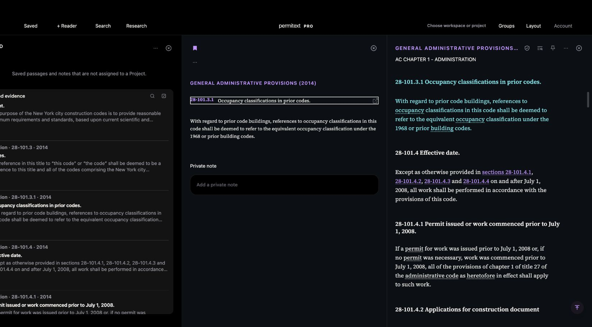

# UX-04/05 historical Saved title and Reader destination

## Bounded rendered case

Synthetic signed-in loopback account; retained unsent Research draft, Saved and an existing2022 Building Chapter1 Reader. Saved28-101.3.1 identifies2014 and “Occupancy classifications in prior codes.” Detail retains the descriptive title and authoritative source. Open in Reader loads General Administrative Provisions(2014), AC Chapter1, with the exact28-101.3.1 passage highlighted and surrounding sections available. The existing2022 Reader and unsent draft remain intact.

## Defect and correction

The detail heading handler waited for its linked Reader and revealed its vertical passage, but omitted workspace horizontal reveal. A new Reader could remain outside the visible workspace. Added `scrollPaneIntoView` after targeted readiness and passage reveal, using immediate navigation for this explicit action. Other Reader navigation paths already call this helper.

After the fix, actual DOM bounds show the600px destination Reader fully within the current workspace viewport (left1133.97/right1733.97; track right1734.29), with the target passage visible. Browser viewport size changed during this session; screenshot output dimensions must not be treated as CSS viewport dimensions or a controlled animation comparison. No measured smooth-animation performance claim is made.

## Checks and scope

- Actual heading listener, linked Reader creation and scroll helper regression covers delayed readiness, failed readiness/no reveal, offscreen geometry and preservation of another occupied Reader.
- UX audit, full UX alignment and offline contracts pass.
- Assets `20260928-detail-reader-reveal-v599`, shell `permitext-pro-shell-v1242`.
- No native changes, owner data changes, paid Research or deployment. This verifies one historical subsection and its destination, not all title hierarchy, entitlement, note/block-level, theme or native acceptance cases.

