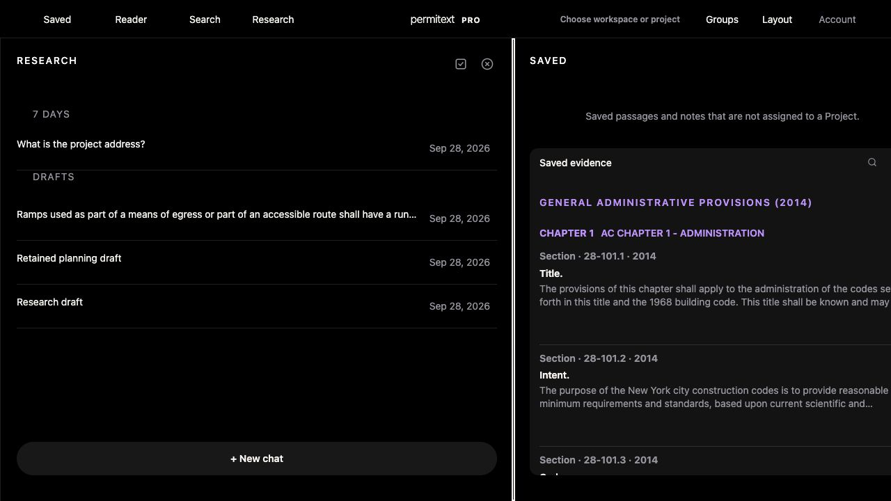

# UX-06 adjacent-column keyboard resizing

## Observed defect

In the populated synthetic web workspace, the divider between two expanded columns was keyboard-focusable but ArrowLeft/ArrowRight had no effect. Reproduction: grow History from600 to680 pixels with Shift+ArrowLeft on the outer left edge, then press ArrowLeft on the divider between History and Saved. History remained680; Saved remained600. The handler only supported a divider with one expanded neighbor.

This is a keyboard accessibility defect, not a measured rendering-speed improvement. Owner data and the physical phone were not used.

## Change

Arrow keys resize both expanded neighbors by24px; Shift uses80px. Each side retains its existing minimum independently, matching pointer drag behavior even when total width grows. Minimum-clamped movement preserves the existing scroll compensation. Outer-edge and one-collapsed-neighbor behavior remains supported; two collapsed neighbors do not resize.

Adjacent dividers report the left-column percentage and explicit left/right pixel widths. Values refresh on mounting, collapse changes, focus and active resize. Pointer updates reuse calculated widths rather than adding layout reads each frame. The pre-existing unbounded outer-edge pixel range semantics are unchanged; a former adjacent percentage maximum is cleared when that handle becomes an edge.

## Verification

- Actual production handlers/helpers pass host regression for both expanded neighbors, independent minimums, scroll compensation, normal/Shift steps, collapsed neighbors, outer edges and missing panes. Added to `test:ux-alignment`.
- Rendered synthetic workspace:680/600 → ArrowLeft656/624 → Shift+ArrowRight736/600. Divider retains focus and a visible2px outline; accessible text reads “Left column736 pixels; right column600 pixels.”
- Reload restores736/600 and retains the unsent Research fixture question.
- UX audit, full UX alignment, offline suites and workspace-state contract pass.
- Shell assets: `20260928-divider-keyboard-v595`; cache `permitext-pro-shell-v1238`.

This is local dark-mode web evidence. Actual light-theme, screen-reader, the legacy unbounded edge range semantics, keyboard reordering/collapse and native accessibility remain separate. No native build, hosted deployment or owner data change.

