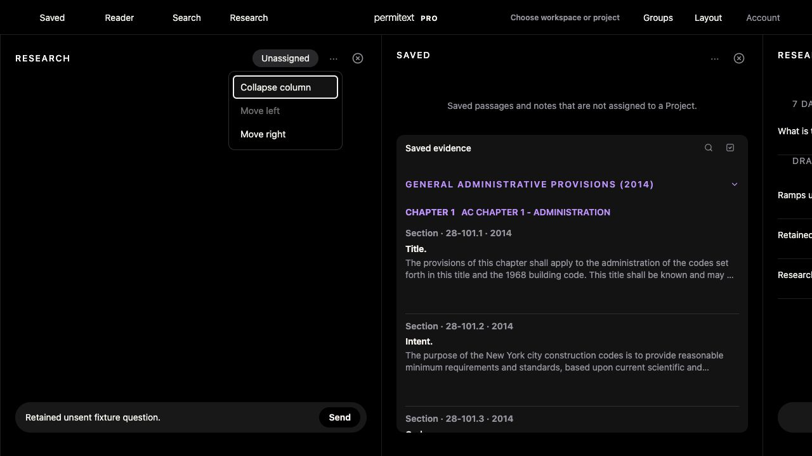

# UX-06 keyboard column actions

## Baseline

Source and rendered guest Reader review show no keyboard alternative for ungrouped column collapse or column dragging. Reader Column options contains text size/spacing; ungrouped Saved/Research has no visible options button. Headers have tabindex-1 and collapse only on double-click. Existing collapsed rails can be activated by keyboard.

## Change

Reuse Column options for supported workspace panels. Offer Collapse column and Move left/right, preserve grouping restrictions and pinned/linked pane ordering. Movement must retain mounted editors and their drafts; closing the menu must restore focus; collapse must focus the rail. No account content edits or paid Research.

The rendered walkthrough also found that supplementary Research panes used the primary conversation identity for dragging and were forcibly repositioned during layout normalization. They now retain their own identity and persisted position. First-open placement and explicit named groups remain intact. Legacy Code Decisions anchors disable affected move actions instead of advertising a move that snaps back; unrelated neighbors remain movable.

## Verification

- Local synthetic signed-in workspace, dark theme: open supplementary Research options using Enter; Move left puts the draft before Saved; focus returns to its options button; Move left is disabled at the left boundary.
- Collapse focuses the existing rail. Enter expands it and retains the exact unsent fixture question. Reload preserves the new order (draft, Saved, History) and question.
- Saved movement also operates by keyboard. No records were deleted, assigned, submitted or sent to paid Research.
- Actual production helper/menu regressions cover independent supplementary Research, initial placement, named groups from a non-first member, Saved/Notebook/Report units, Settings boundaries, retained mounted editor identity/text/scroll, disabled-item navigation, Escape/expanded state, group focus and private group exclusion for guests.
- Full UX alignment (now includes pane-collapse regression), Research workspace continuity, Research handoff, workspace-state, UX audit and offline contracts pass.
- Shell: `20260928-column-actions-v597`, `permitext-pro-shell-v1240`.

## Remaining scope

This closes the reproduced keyboard access gaps locally, not all UX-06 acceptance. Actual light-theme, assistive-technology, broader populated Project/Report visual matrix and native checks remain. Collapsed columns can be expanded with the keyboard to access movement; no second control was added to narrow rails. No Production deployment or physical build installation occurred.

