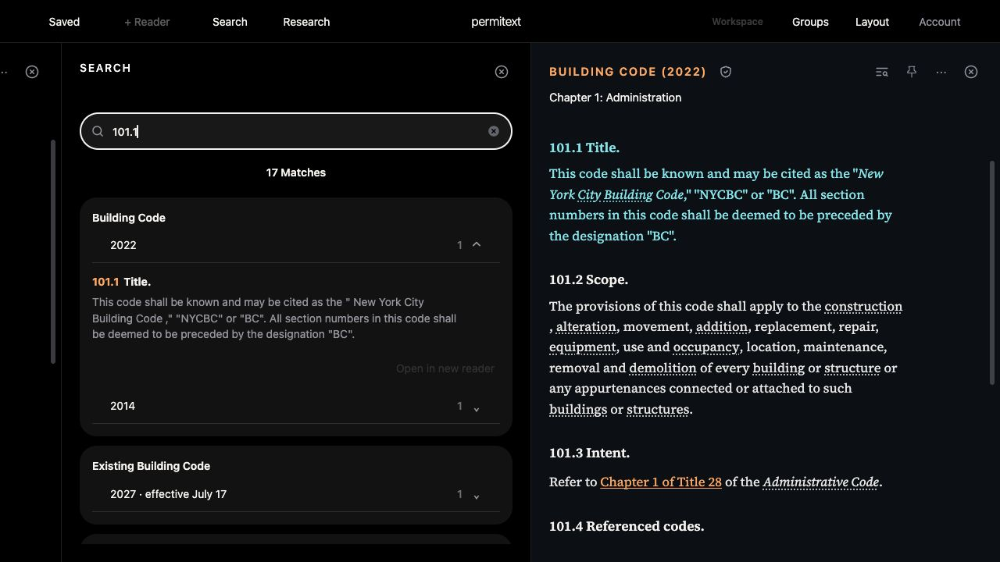
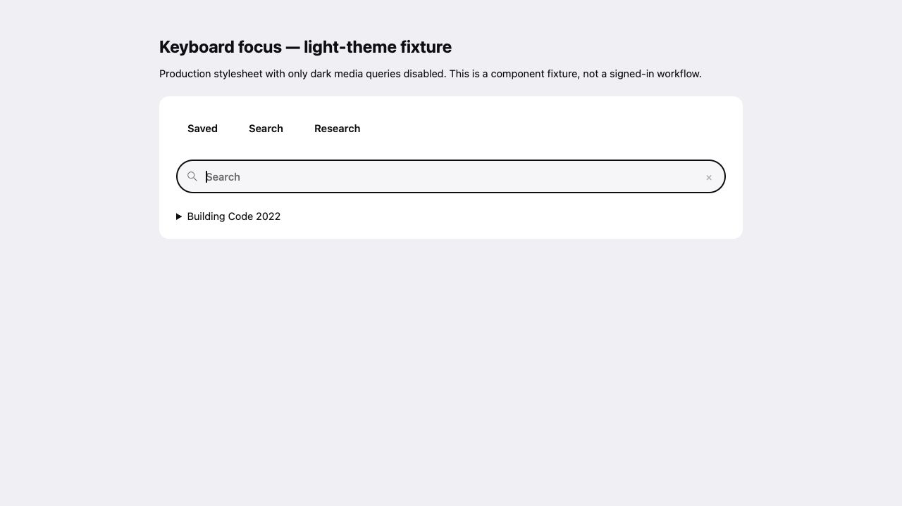
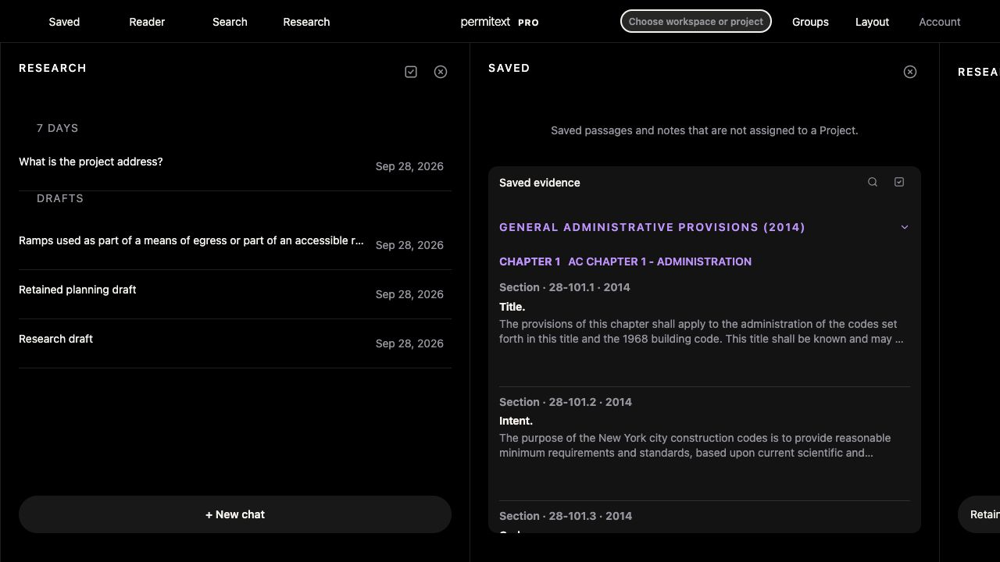

# UX-06 keyboard focus — September 28

Status: implemented and locally verified for the bounded cases below; broader UX-06 acceptance remains incomplete.

## Change

Removed blanket keyboard-outline suppression. Supported controls use the neutral semantic `--focus-ring` token with a2px inset outline, avoiding toolbar clipping. Composite Search fields show one ring around the whole field. Pointer-focused buttons retain no outline. No native UI changes.

Shell assets are `20260928-keyboard-focus-v587`, shell cache `permitext-pro-shell-v1230`. Required offline tests exposed an older offline-storage generation (v1224/v581) that did not match the worker; all shell consumers now agree. Immutable code/figure cache identities remain unchanged.

## Rendered evidence

Local workspace at `http://localhost:8787/workspace`, separate local data store, existing guest browser state. No account sign-out, owner data edits or paid Research.

- Before: keyboard-focused Saved had `outline: none 0px` and no shadow.
- After: toolbar focus ring is visible without clipping. Search uses one surrounding ring; result buttons and disclosures use visible rings.
- Keyboard sequence: Search input → Clear → Building2022 disclosure → collapse/expand → result opening. Disclosure retains focus and updates expanded state; result remains focused after its asynchronous Reader destination completes.
- Account opened by keyboard; Escape returned focus to Account. Groups pointer click had no keyboard outline; Escape retained its trigger.
- No browser console errors were captured in this bounded flow.
- Light theme was checked in an isolated component fixture using production CSS with dark media queries disabled. This is not a full application light-theme or signed-in workflow test; Mac appearance was not changed.
- Focus-ring contrast: light Search18.16:1, light white surface19.42:1, dark Search16.11:1 (rendered alpha background composited over black), dark black surface19.13:1. These values cover the changed ring, not every existing label/icon.

## Automated checks

`audit:ux-ui`, full `test:ux-alignment`, and `test:offline` pass. Several pre-existing contract fixtures still expected retired wording/layout or omitted new in-place-refresh dependencies. Updated tests now require recoverable Trash wording, current Saved/Unassigned titles, retained missing-facts content, both cancellation and stale-navigation guards, visible and accessible save-state feedback, and account-scoped refresh ordering. No product behavior was reverted to satisfy stale assertions.

## Remaining

Full signed-in Saved actions, all dialogs and pane operations, full application light-theme walkthrough, assistive-technology checks and native VoiceOver/Dynamic Type remain separate. No Production deployment, main merge or release is implied.

## Populated fixture follow-up

Verified the synthetic signed-in workspace using production app code on loopback, without owner data or paid Research. Saved opens with Space; selection mode toggles, Enter selects a passage and exposes project/delete actions, and Cancel exits selection. No delete or assignment was submitted.

Found and fixed a dialog return-focus bug: workspace menu actions removed their focused menu item before opening a dialog, so New Project captured the page body as its previous focus. Menu actions now focus the connected menu anchor (falling back to the workspace toolbar button) before running the action. This gives dialogs a durable return target.

Rendered verification after reloading the fix:
- New Project initially focuses Name; reverse Tab reaches Cancel and wraps to the last color control, keeping focus in the dialog.
- Escape closes New Project and returns focus to Choose workspace or project, with its visible focus ring.
- Manage Projects initially focuses Close; Escape likewise returns to the workspace trigger.
- The retained Research fixture draft remains present after reload.

Assets are now `20260928-dialog-focus-v594`, shell `permitext-pro-shell-v1237`. UX audit, full UX alignment and offline suites pass. This expands the bounded keyboard evidence; it does not close all Saved actions, dialogs, pane operations, screen-reader, full light-theme or native accessibility acceptance.

Adjacent expanded-column arrow resizing was also missing and is now implemented with rendered persistence evidence and host regression: [divider report](UX_06_ADJACENT_RESIZE_2026-09-28.md). Keyboard reordering/collapse, broader dialogs, assistive technology and full theme/device acceptance remain open.

Keyboard collapse/reordering now has a rendered and regression-verified implementation, including supplementary Research identity/order preservation: [column actions](UX_06_COLUMN_ACTIONS_2026-09-28.md). This supersedes the earlier keyboard-collapse/reordering gap; broader theme, screen-reader and native acceptance remains open.

## September 29: authenticated Notebook editor name

Production test-account inspection confirmed that Tab moves from the Note title through “Expand Notebook references” into the editable body. The body had `role="textbox"` but neither `aria-label` nor `aria-labelledby`; only its surrounding container was named. No production note content was changed during this check.

The candidate now sets the editor's own accessible name from its caller-provided label, falling back to “Note body”, and sets `aria-multiline="true"`. The existing generated editor fixture at port8917 exposed textbox “Notebook smoke editor”; a synthetic edit emitted one document change while retaining its linked reference, bold/italic text and lists. Screenshot: `/tmp/permitext-notebook-label-20260929.png`. Notebook dependency security/build and web shell caching contracts pass. Bundle18, shell1251 and web version608 invalidate prior assets together.

This is local rendered/DOM acceptance, not a VoiceOver session or deployed acceptance. Native accessibility and the other outstanding cases remain open.

## September29: appearance prerequisite and rendered dark text

The full workspace follows `prefers-color-scheme` (`public/styles.css`: light root tokens, dark media overrides); there is no workspace theme selector. Notebook likewise follows the media preference unless an explicit root theme is supplied. The browser control surface exposes viewport and visibility but no isolated color-scheme override. Owner confirmation for a temporary Mac Light appearance change/restoration is pending; no OS appearance was changed, and no full-app light acceptance is claimed.

Read-only Production v607 inspection of the authorized test Note confirms enabled14px text at opacity1. Its title uses sRGB(0.568,0.607529,0.844706), New Note uses RGB(160,159,167), and Insert evidence/body uses RGB(246,244,241), all on the observed RGB(18,18,19) surface. Calculated relative-luminance contrast ratios are7.02:1,7.14:1 and17.05:1 respectively. This bounded check found no contrast issue in those controls; it does not certify every label/icon, all appearance variants or screen-reader operation. No content was edited.

## September29: Saved selection state on the operable button

Production v607 reproduced a semantic gap: selecting the existing test passage exposed a delete action and visual selection, but its focused Open button had no selected/pressed state. The bulk controller applied aria-selected to an article, which does not support that state. Selection was cancelled without modifying the passage or Note.

Candidate web609/shell1252 now applies aria-pressed to each Saved passage button while selection mode is active and removes it on exit. An isolated populated fixture using the actual app at port8822 verified false before selection, true after Enter, false on an adjacent unselected row, false after Space deselection, and absence after Cancel. All six ordinary Remove buttons returned. No deletion or assignment was submitted. Screenshot: /tmp/permitext-saved-selection-20260929.png.

JavaScript syntax, shell-coherence/update lifecycle, build-output contracts and the complete test:ux-alignment suite pass. This is local keyboard/DOM evidence, not a VoiceOver session or hosted609 acceptance. The earlier608 preview remains valid evidence only for that older runtime; current candidate hosted identity must be checked before release.

Hosted follow-up: deployment dpl_CvNqTLHXN8GM6T5FXSuPpMS5mqTX is READY at d7f1191dd. All six public workspace/shell/Notebook representations return200 with exact candidate bytes and expected cache policy; [receipt](../performance/PERF_PREVIEW_609_IDENTITY_2026-09-29.json). Full npm run smoke also passes. Production remains unchanged; application-authenticated preview and assistive-technology acceptance remain open.

## September29 afternoon: Unassigned confirmation and keyboard cancellation

A fresh isolated populated fixture reproduced incorrect confirmation wording in Unassigned saves: “Delete 1 selected item from this project?” with no Project open. The shared bulk confirmation now asks “Delete 1 selected item?” without inventing a Project context. Runtime web610/shell1253 invalidates the changed app; Notebook18 is unchanged.

Rendered keyboard verification: opening the alertdialog shows the corrected message; Shift+Tab from Cancel reaches Delete, Tab returns to Cancel, and Escape closes the dialog and restores focus to Delete selected evidence. Cancelling selection restores all six ordinary Remove controls. No deletion or assignment was submitted. Screenshot: /tmp/permitext-saved-confirmation-20260929.png. A locator evaluation timed out once; subsequent DOM/AX observations confirmed the dialog remained open and focus was on Delete, so no duplicate activation was attempted.

JavaScript syntax, shell lifecycle/coherence and build-output contracts pass. This is local rendered keyboard acceptance, not a VoiceOver or full light-mode check. Hosted609 identity remains historical; web610 requires its own hosted verification before release.

## September29: owner-authorized system Light appearance

Owner authorized temporary Light appearance. System Settings initially showed Dark selected; switched to Light and inspected the actual full app at port8825 with the isolated small Pro fixture, without CSS/media overrides. Populated Saved and Notebook, Project menu, Search input and masonry result groups rendered in light colors. Saved/Notebook text and controls were readable in the captured views, with no missing primary controls observed. Notebook body computed RGB(13,13,15) on white; Report button RGB(13,13,15) on sRGB(0.456,0.501333,0.546667).

Screenshots: /tmp/permitext-light-workspace-20260929.png and /tmp/permitext-light-search-20260929.png. No Note text, Saved membership or Production data was changed. The search-result Enter action was attempted but a Reader destination was not verified, so this does not claim Reader/detail acceptance. Full dialog/Report/light Reader and assistive-technology checks remain separate. This expands actual-app light coverage beyond the earlier isolated CSS fixture, without claiming exhaustive theme certification.

Restored the original Dark appearance; System Settings confirmed Dark selected. Closed the fixture tab and stopped the fixture process. No product change was required for the inspected views.

## September29: Light Reader and New Project placeholders

Using owner-authorized system Light appearance, the actual app at port8826 rendered Building Code2022 Chapter1, including101.1 Title,101.2 Scope and101.3 Intent. The visible text and linked terms were readable. The Reader reported17 of107 sections loaded; this checks the initial Reader view, not the entire chapter or every detail variant. Screenshot: /tmp/permitext-light-reader-20260929.png.

New Project exposed very pale placeholders: RGB(183,183,191) on grey fields. A light-only CSS rule now uses RGB(85,85,94), opacity1, for Project input/textarea placeholders. Reloaded rendered verification confirmed the new color and clearer Name/address/Description prompts without changing layout. Screenshot: /tmp/permitext-light-dialog-fixed-20260929.png. No Project was created.

Restored original Dark appearance and confirmed Dark selected in System Settings. Reopened New Project: its placeholder remained RGB(111,111,120), matching the existing dark --text-tertiary token. Cancelled the dialog, closed the test tab and stopped the fixture.

Web611/shell1254/Notebook18 is the current local candidate. Offline-shell coherence and build-output contracts pass. Hosted610 evidence is historical for that runtime; hosted611 identity, authenticated staging, Report, VoiceOver and native checks remain open. This is bounded rendered/DOM evidence, not full contrast or accessibility certification.
