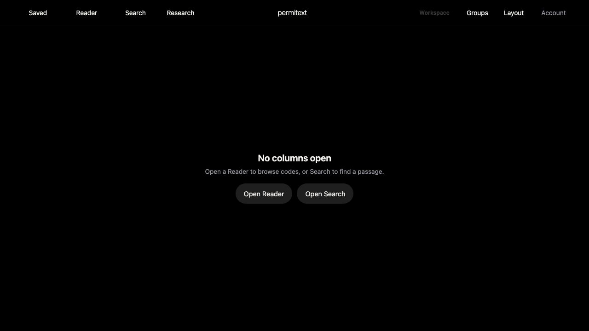

# UX-08: empty web workspace guidance — 2026-09-28

## Change

Closing every column previously left a blank workspace. A genuinely empty established workspace now displays “No columns open,” a short explanation, and Open Reader/Open Search actions. Existing first-use onboarding remains separate. Loading/error panes count as panes, and detached Project windows are excluded.

Actions delegate to existing toolbar controls rather than duplicating navigation or entitlement logic. Focus moves to the stable toolbar control before the guidance unmounts. Buttons have visible text names, 44px minimum height, and the shared keyboard-focus treatment.

## Verification

- Local guest workspace at localhost:8787; no owner account content changed.
- Closed the last Reader: guidance appeared.
- Activated Open Reader with Enter: guidance disappeared, “Loading Reader…” appeared, focus remained on Reader toolbar control, then Building Code 2022 Chapter 1 loaded.
- Closed Reader and activated Open Search with Enter: Search controls and its empty-query explanation appeared; guidance disappeared; focus remained on Search toolbar control.
- Inspected the rendered dark-mode screenshot below.
- Passed `npm run audit:ux-ui`, `npm run test:ux-alignment`, `npm run test:offline`, and `npm run test:readiness-recovery`. Audit reminder for dynamic buttons reviewed against names, focus, target size, and existing delegated behavior.
- Shell assets updated coherently to 20260928-empty-workspace-v589 / permitext-pro-shell-v1232.

## Remaining acceptance

Native Saved guidance, populated signed-in workflows, actual light-mode application rendering, and hosted rollout are not established by this local check. UX-08 remains partially complete. No native redesign or release is included.
