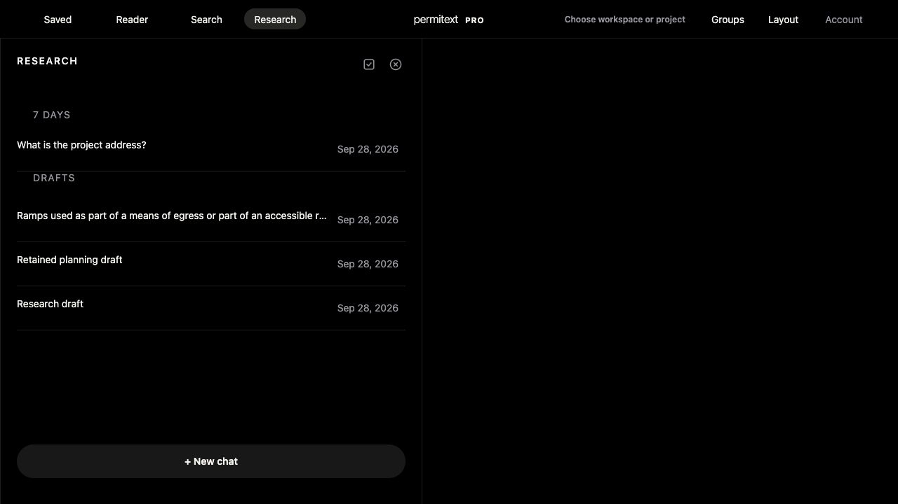
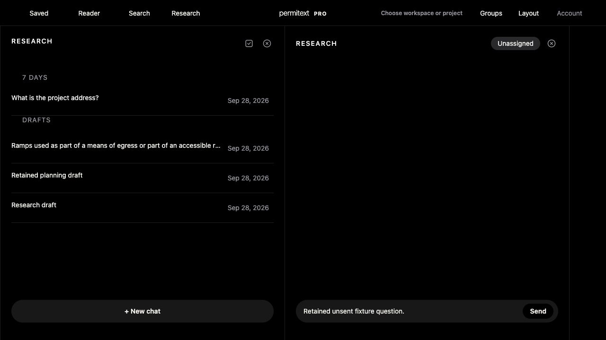

# UX-09: visible Drafts after submitted conversations

## Outcome

Web and native Research history now place records with a known zero message count in a final Drafts section. Every record remains visible and directly openable. Web Drafts is not collapsible, so stored date-group collapse preferences cannot conceal draft text, evidence or interrupted work. Existing chronology is preserved within the submitted groups and within Drafts. Unknown/invalid web counts stay in ordinary chronology. Native summaries already require an integer message count; the change does not weaken decoding or introduce defaults.

The generic title “Empty draft” is now “Research draft.” Custom titles and evidence-derived titles are preserved. The grouping describes submission state, not content emptiness, and does not use the earlier confirmed-empty predicate to hide or delete anything.

## Why this direction

Current-workspace draft state cannot establish absence elsewhere: regular and detached workspace snapshots, closed groups, other tabs' pending selections, and other devices may retain work. Server-created code-basis context also prevents the conservative classifier from proving ordinary modern records empty. A visible section improves ordering without requiring an unsafe absence claim or a new cross-device draft protocol.

## Local rendered evidence

Used `tests/populated-workspace-performance-fixture.mjs --port 8805 --research-history true` with disposable loopback-only accounts and storage. Default performance fixture behavior is unchanged. External/provider requests are forbidden by the fixture. One answer was generated by the existing deterministic Project-address path during seeding; browser Research mutation/message routes remain blocked after seeding. No owner account or paid Research was used.

- Persisted API receipt proves one submitted conversation and three drafts: generic, renamed, and selected-evidence.
- Browser history shows the submitted conversation first and all three drafts below a noncollapsible Drafts heading.
- Opened the renamed draft, typed an unsent synthetic question, returned to history, reloaded the entire workspace, and reopened it: the exact text remained.
- Opened the evidence draft: its BC1010.2 selected passage remained visible and its Open source action remained available. The previous unsent draft also remained in its independent conversation pane.
- Screenshot and sanitized fixture receipt are adjacent files. No capability/session tokens are included.

## Verification and limits

- Actual web grouping/title and native stable-partition/title host contracts pass, including missing/invalid counts and unchanged record identities/order.
- Full UX alignment, offline and UX audit pass.
- Native generic iOS Release41.30 compilation and strict signature verification pass; no simulator or physical installation was used for this change.
- This closes the bounded web clutter correction, not native rendered acceptance, live PostgreSQL verification, Production rollout, or the full cross-device recovery matrix. Automatic hiding/deleting/reusing drafts is not implemented.

## Additional regression found during the walkthrough

After the initial reload check passed, a longer history → evidence conversation → history transition cleared the retained composer. Source inspection identified a global draft broadcast in `refreshVisibleResearchArtifactConsumers`: one `researchQuestionDraft` value was copied into every mounted composer and dispatched as input, overwriting per-conversation drafts. The initial reload success does not close this broader retention case. The fix removes the broadcast and synthetic input dispatch, preserving each conversation’s durable draft. Focus restoration is keyed to the same composer, and account/workspace changes abort post-refresh restoration.

The actual-function regression failed before the fix and passes after it. It covers distinct drafts, reload, supplementary panes, history, explicit clearing, and account/workspace changes. Existing checkpoint and continuity contracts pass; the latter DOM stub was supplied the actual dataset property used for focus identity and asserts its value.

A fresh isolated rendered fixture repeated the failing sequence: named draft → type → history → reload → named draft → history → evidence draft → history → reload. The named composer retained the exact unsent text after both the formerly failing transition and final reload. No Send action occurred.

Fixture safeguards also reject normalized/absolute-form Research mutation routes and forbid redirect-following fetches. Shell/import/precache assets are coherent at v592 / shell1235.
