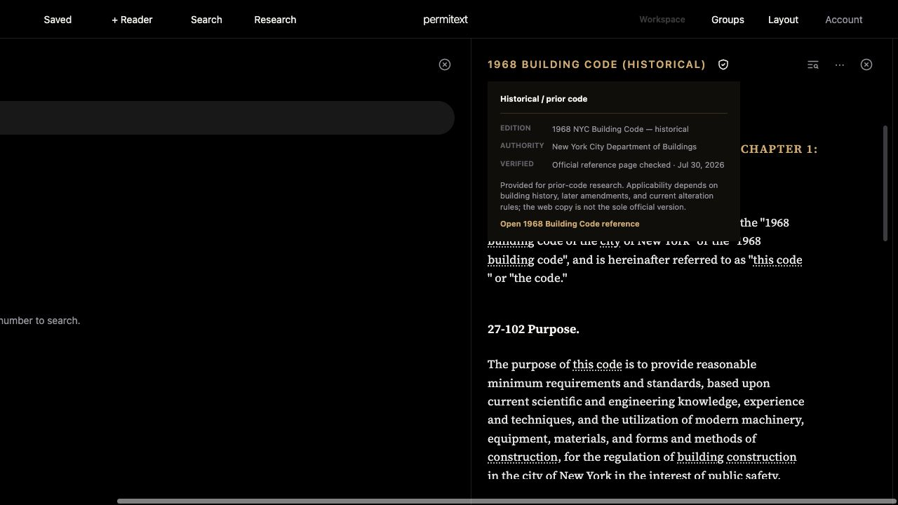

# UX-10: bounded web source context review

## Observations and change

At the Reader's existing 600px minimum width, Building Code2022 Chapter5's long title remains readable. Resizing the neighboring pane keeps Reader at600px and introduces horizontal workspace scrolling; this review does not change that width policy.

The Existing Building Code's long label truncates before its full effective date. Its existing authority disclosure already renders “Enacted · not yet effective,” the complete July17,2027 date and its source link. Historical1968 disclosure identifies historical/prior-code context and explains that applicability depends on the building's history and later rules. These are observations of existing product copy, not a new legal applicability determination.

Added full selected-label `title` attributes to Reader code/chapter triggers so the original label is available on pointer hover. Existing complete accessible names and openable menus remain. No sizing, enacted text, date metadata or authority wording changed; no redundant Upcoming badge was added.

## Verification

- Local guest workspace, dark mode, browser viewport1280×720, two panes and horizontal workspace scrolling.
- Selected Chapter5 through the chapter tree and confirmed the long chapter label.
- Inspected Existing Building Code authority details with its full effective date.
- After reload, DOM titles match the full code/chapter labels. Switching to1968 updates both titles to the new source; no stale2027 tooltip remains.
- Rendered historical source panel below. The screenshot verifies the disclosure; native browser tooltip appearance itself was not captured.
- `audit:ux-ui`, `test:ux-alignment`, `test:offline` pass. Shell/import/precache identity is v593 / shell1236.

## Remaining

Native two-Reader context, truncation and Dynamic Type, actual light-mode application rendering, touch target matrix and hosted release acceptance remain open. This is a bounded web improvement, not completed UX-10.
