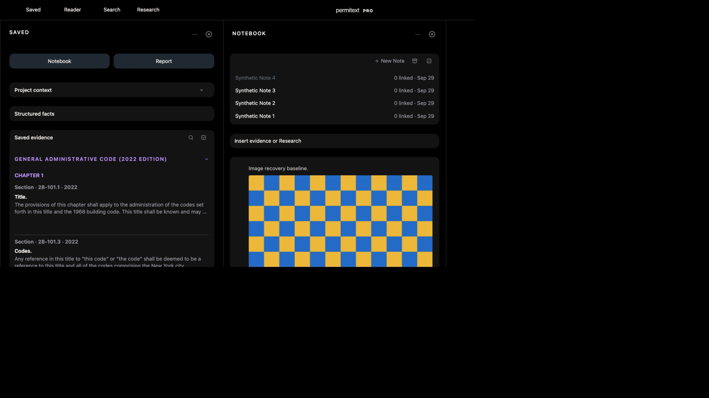

# UX11: actual editor image upload interruption

September29. Local isolated fixture8821 on sourceba43fa0ce. No owner data, physical device, simulator, Instruments or provider calls.

## Rendered and canonical evidence

- Opened Synthetic Project1 / Note4. Entered “Image recovery baseline.” and used the editor’s `/image` suggestion → Upload image → actual file chooser.
- Input was a generated2400×1600 checkerboard PNG,64,775bytes. Production optimization rendered it at2048×1365; original-byte equality is not expected after optimization.
- Before selecting the file, enabled complete application transport loss. Fixture logged failed POST `/notebook/assets/upload`; the editor displayed the local image and an accurate “Notebook image not synchronized” notice. After dismissing that notice, the workspace read “Offline · 1 pending”.
- Closed and reopened Notebook while transport remained off. The same selected Note retained its text and decoded image. This is pane reopen, not a full offline browser reload.
- Restored transport. Canonical readback before browser recovery showed version5 with the baseline paragraph and an empty image placeholder, no uploaded asset URL.
- Reloaded to recover. Canonical readback returned version6 with the unchanged paragraph and exactly one image block using `permitext-notebook-asset:`. UI showed Synced and one complete2048×1365 image. A further online reload retained the text and same decoded dimensions.

## Boundaries

The prior `notebook-transfer-browser.mjs` harness covers partial-body/lost-acknowledgement and same-identity retry using extracted production functions and a tiny image. This new check adds the actual editor/file-picker/optimization/local-rendering path. It does not replace that lower-level evidence or prove mid-body interruption of this larger file.

Prepared offline full reload with text passed separately. A pending image through full offline browser reload, multi-image pressure, quota exhaustion, expired credentials, native and hosted image recovery remain separate. No product fix was needed for this bounded result.
