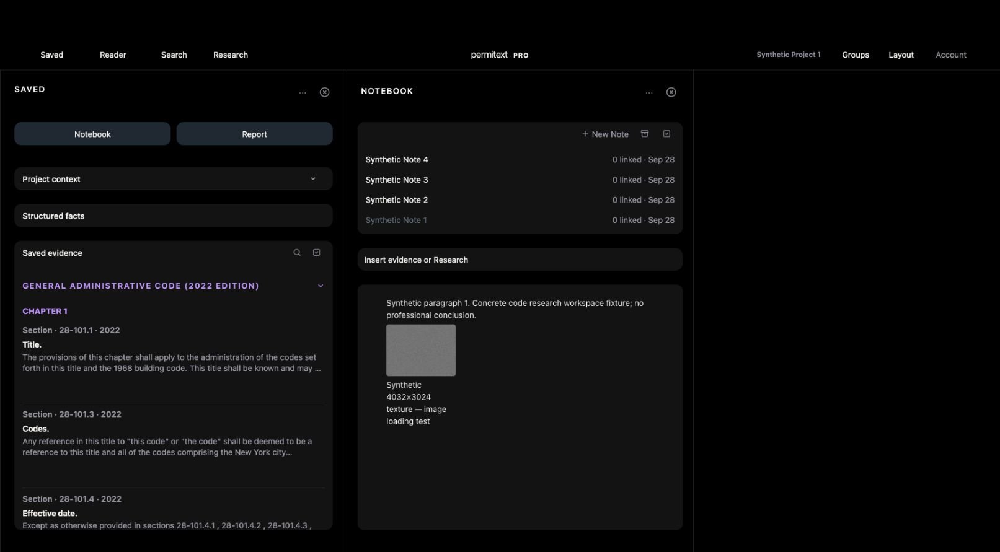

# UX-11 / PERF-16 — bounded large-image acceptance

September 28, 2026. Local isolated account only; no production or native acceptance.

The optional `--image-profile photo-size` fixture uploads a deterministic synthetic grayscale PNG through the real Notebook HTTP route, authenticates its readback, checks identical SHA-256 and bytes, and verifies the saved Note retains the asset reference. Default tiny fixtures remain unchanged.

- Dimensions: 4032 × 3024 (12,192,768 pixels).
- Encoded size: 6,174,681 bytes, below the 8 MiB Notebook limit.
- SHA-256: `355cc15d27865ac0023d6c17682815efaaf69461f40d9017fba1698546793f7b`.
- Arithmetic RGBA size: 48,771,072 bytes. This is not measured browser memory.
- Fixture outage self-test with this image passed (agent); parent independently verified HTTP upload/readback receipt on port 8807.

## Rendered result

Opened Synthetic Project 1 → Notebook → Synthetic Note 1 in the in-app desktop browser. DOM reports `complete=true`, `naturalWidth=4032`, `naturalHeight=3024`, displayed at 120 × 90 CSS pixels. Paragraph, caption, project context and surrounding Saved pane remain visible.

Reload restored the project and Notebook but selected Note 4. Reopening Note 1 again decoded the retained image at the same natural and rendered dimensions. This proves asset/content retention, not selected-Note restoration. Track reload selection continuity separately from already-tested project-return continuity.

## Limits / remaining

This is one synthetic image, uploaded by the HTTP fixture, not a browser file-picker or real photo workflow. It does not establish latency percentiles, frame rate, peak memory, multiple-photo pressure, image-specific outage recovery, physical iOS, or hosted acceptance. No production application behavior changed.
