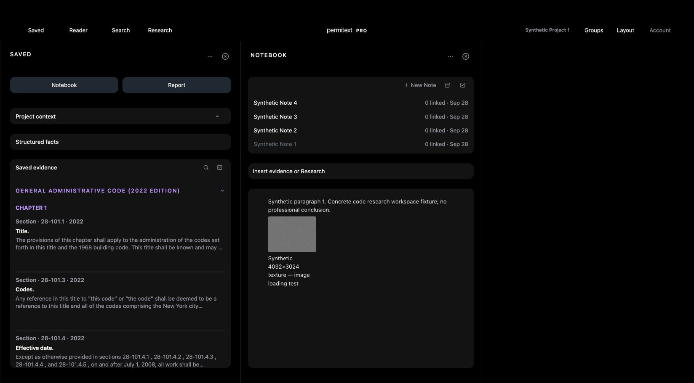

# UX-11 — selected Note survives workspace reload

September 28, 2026. Local browser acceptance; no native or hosted claim.

## Problem and change

Selecting Note 1 then reloading restored the project and Notebook but selected Note 4. Selection was held only in an ephemeral Map.

Persist up to 100 Note IDs locally, scoped to account, workspace and project. No Note contents are stored by this feature or selection synchronized to another device. Current-account/generation checks reject stale writes. Restore only a current-list, nondeleted, nonarchived Note; missing selections are pruned. Explicit navigation and recoverable unsaved drafts retain priority. Existing account cleanup covers the storage prefix; storage errors do not prevent editing.

## Verification

- Focused return-card contract: fresh JavaScript runtime restoration, account/workspace/project isolation, missing/deleted/archived pruning, bounded storage, malformed/denied storage, explicit navigation, 404/410 recovery and stale-request guards pass.
- Return-scroll and Notebook durability contracts pass.
- Offline asset/import-graph/readiness contract and JavaScript syntax pass after updating web assets to v602, shell v1245.
- Same isolated large-image fixture on localhost 8807: loaded v602, selected Synthetic Note 1, confirmed its title and decoded 4032×3024 image, reloaded, then observed Note 1 and the decoded image restored automatically without selecting a Note again.

This closes the selected-Note reload issue found in the large-image check. It does not claim editor selection/scroll restoration across reload, multi-device selection synchronization, native acceptance or release deployment.
