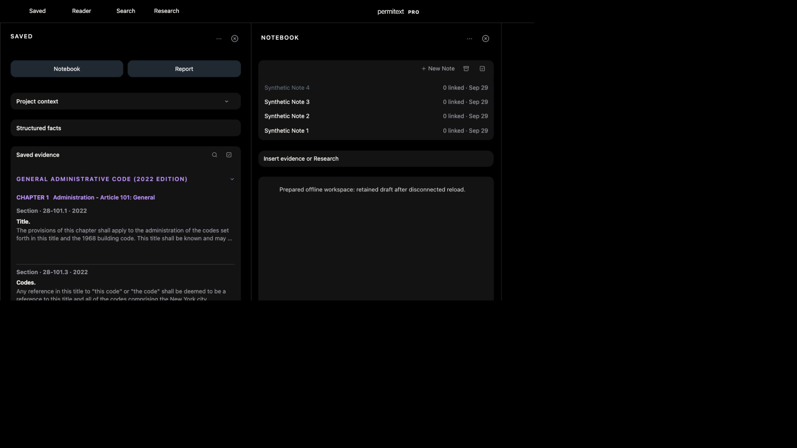

# UX11: prepared offline Notebook and Saved recovery

September29. Local full-app fixture8820, source5c5008a60. Production and native acceptance remain separate. No Instruments, simulator or owner data used.

## Rendered sequence

1. Created an isolated synthetic account with12 Saved items,2 Projects and4 Notes. Used Account → Download for Offline Use. UI progressed through578 chapters and ended at “Downloaded for Offline Use”.
2. Reloaded online, opened Synthetic Project1 → Notebook → Synthetic Note4. This loads the editor module and caches the previously opened Note before interruption.
3. Enabled the fixture’s bounded complete application transport outage. Edited the Note to “Prepared offline workspace: retained draft after disconnected reload.” Its save failed at transport.
4. Reloaded while transport was still off. The app shell rendered; Saved and Notebook recovered after access checking. Selected Note4 retained the exact edit and the status read “Offline · 1 pending”.
5. Opened saved28-101.3 Codes while still disconnected. Its detail displayed GENERAL ADMINISTRATIVE CODE (2022 EDITION), the correct section and full text. The Notebook draft remained present.
6. Restored transport. Before browser recovery, canonical server readback was still version1/original text. Reloaded; server readback then returned version2 with the exact retained edit. UI showed “Synced” and the selected Note still contained that text.

## Evidence and limits

The accompanying JSON records dropped GET/POST routes and canonical before/after Note documents. During the offline observation, transport remained off: workspace HTML, code routes, Notebook list/get/save, project state and sync requests were rejected before the handler. Service-worker/local persisted data therefore supplied the observed content.

This closes the bounded prepared-shell + previously opened private Note + pending draft + Saved detail recovery case. It is simulated server transport loss, not an OS airplane-mode or physical-device test. Unopened Notes, image-upload interruption, expired-session/account transitions, Report offline support and broader resource stress are not established by this run. No product-code change was needed.
