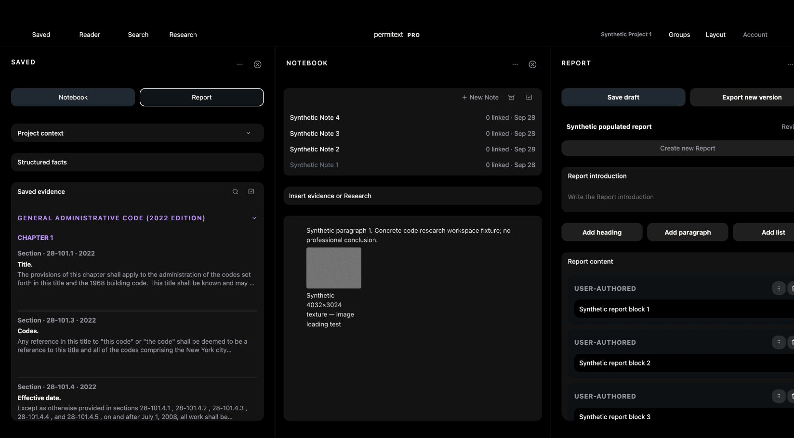

# UX-11 — rendered Saved assignment workflow

September 28, 2026; local isolated synthetic account, web v602. No owner records, native acceptance or deployment involved.

## Verified journey

1. Created disposable local workspace “Assignment check” and opened Saved. Six unassigned 2014 passages were visible.
2. Selected “28-101.2 Intent.” via Select saved evidence, then chose Synthetic Project 1 from Add selected evidence to project.
3. The passage disappeared from Unassigned and appeared under Project 1’s General Administrative Provisions (2014) group.
4. Reload retained the assignment. Opening its detail displayed “GENERAL ADMINISTRATIVE PROVISIONS (2014)”, heading “28-101.2 Intent.”, the full matching purpose paragraph, and Remove from project: Synthetic Project 1.
5. Authenticated real HTTP sync/pull confirmed 12 Saved items unchanged and 7 memberships (previously 6). The new membership is manual, folderClientID `performance-project-1`, sectionID `41000001`, canonical version `CodeContent/authored/new-york-city/2014-construction-codes/bundle.json#1`.
6. Project Notebook retained Synthetic Note 1 and its paragraph/image. Report opened as “Synthetic populated report”, Revision 1, with all eight original heading blocks in order.

This closes the previously unrecorded rendered assignment mutation in UX-11 item 2. Existing separate records cover Notebook/Report editing, exact Reader navigation, failures and pending-draft pane continuity. No product change was needed. This is not cross-device sync or production acceptance.
