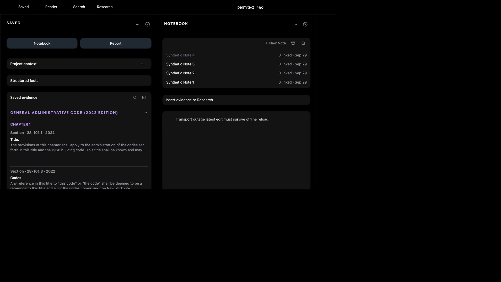

# UX11: complete application transport loss and draft recovery

September29. Bounded local acceptance on source111afcea4 plus test-fixture transport controls. No Production, iPhone, OS airplane mode or prepared-offline-shell claim.

## Scenario and evidence

1. Isolated loopback fixture8819, synthetic Project1/Note4;12 Saved items,2 Projects,4 Notes. Baseline canonical Note version1 had its original paragraph. No owner account or external provider requests.
2. Armed capability-protected transport loss for up to300seconds. All application methods drop their sockets before the real handler, including GET and POST; only fixture diagnostics/control remain reachable. Browser network settings and `navigator.onLine` are unchanged.
3. Edited Note twice. The first edit showed “Offline · 1 pending”; the second was exactly “Transport outage latest edit must survive offline reload.” Both save requests and background artifact requests failed at transport.
4. Reload during the outage produced browser ERR_EMPTY_RESPONSE. This fresh origin had not prepared an offline shell; source registers the worker through `prepareOfflineShell()` rather than unconditional startup. This run therefore does **not** pass reopening a prepared offline workspace.
5. Restored transport. Before reopening the browser, canonical HTTP readback still showed version1/original text, proving outage edits had not reached the handler.
6. Opened a fresh tab at the ordinary workspace URL (the in-app browser error page prevented reusing its navigation API). Selected Note4 and latest text restored automatically. Two queued saves succeeded; canonical HTTP readback returned version3 with the exact latest text. The list still displayed four Notes and the UI returned to “Synced”.

## Test support and limits

`tests/populated-workspace-performance-fixture.mjs --profile small --port 8819 --self-test-outage true` now verifies transport-control capability and duration limits, dropped GET/POST requests, reachable recovery control, restored responses and seeded-Note-only canonical readback. Existing bounded503 outage/idempotence cases also pass. The standalone offline Notebook durability contract passes.

This establishes retained latest draft across complete application transport loss, failed navigation and later reopening. Prepared offline shell/private Notebook availability, image-upload interruption, native interruption and hosted acceptance remain separate. No product-code change was needed for this recovery result.
